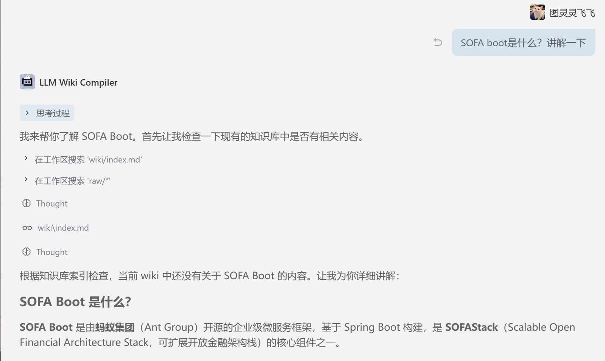
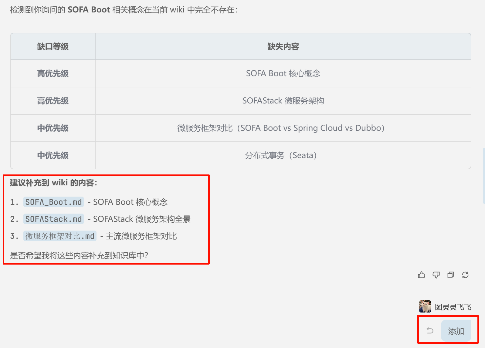
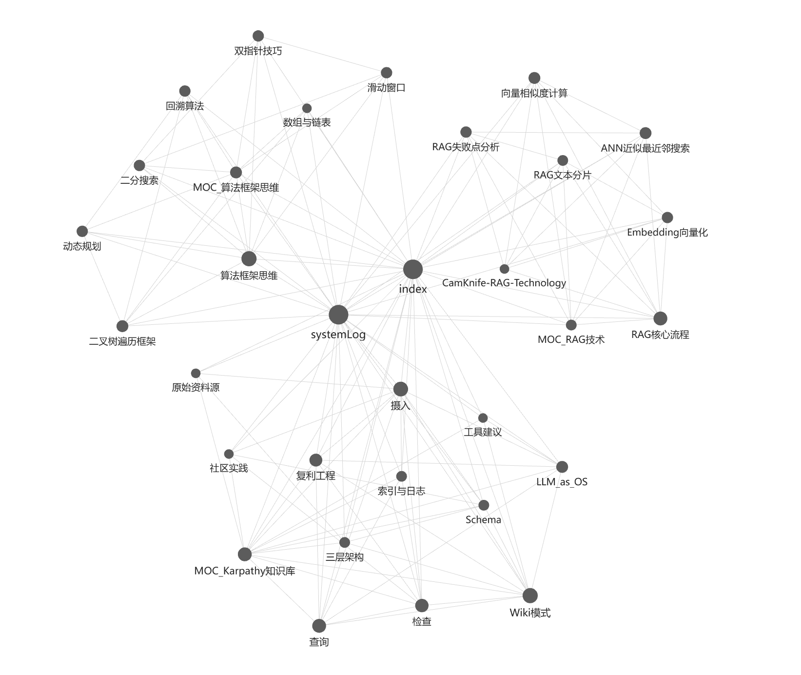
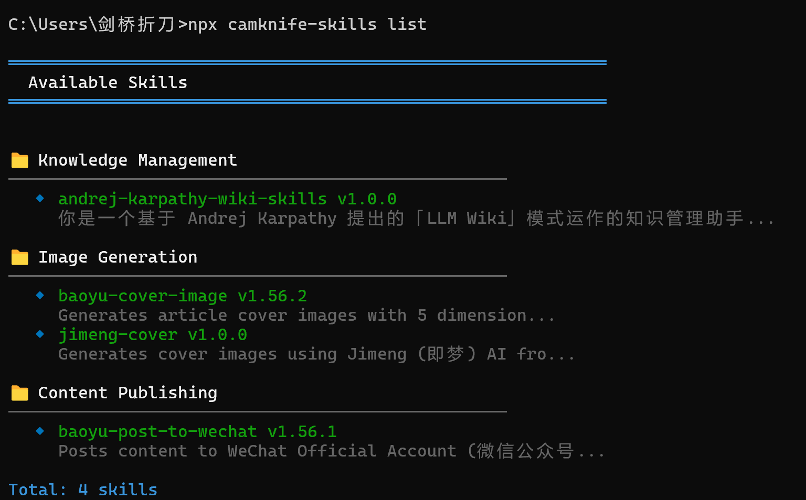
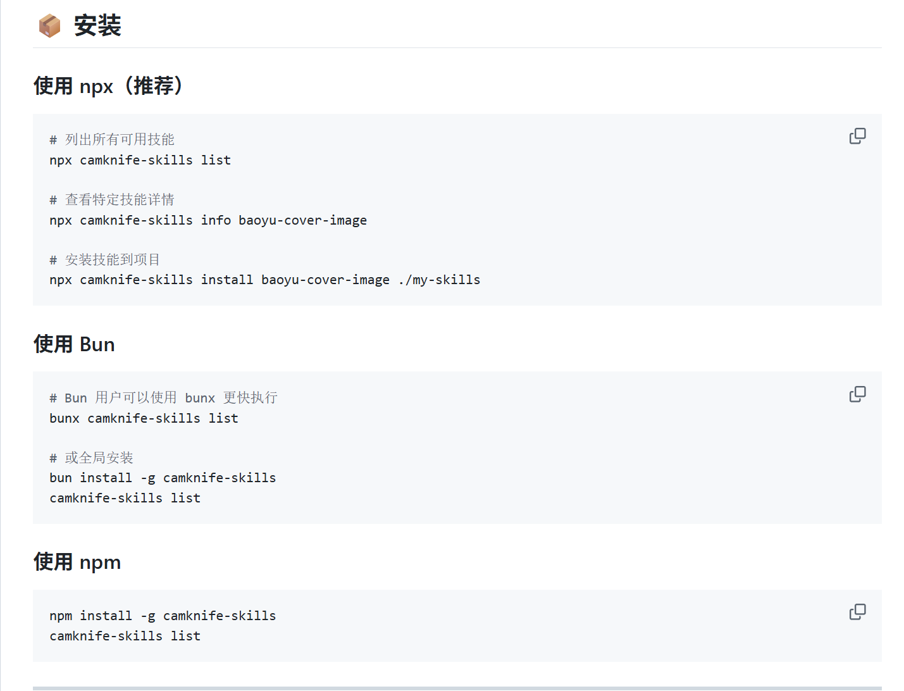

---

title: Andrej Karpathy：如何用 LLM 构建个人知识库
date: 2026-04-15
categories:

- AI
- 知识管理
  tags:
- LLM
- 知识库
- AI Agent
- Karpathy
- wiki
- 知识缺口
  author: 剑桥折刀

---

# Andrej Karpathy：如何用 LLM 构建个人知识库

## 概述

前几天 AI 领域知名专家 Andrej Karpathy 发布了一条推文，介绍他如何利用大型语言模型（LLMs）为各种感兴趣的研究主题构建个人知识库。这条推文获得了超过千万阅读量，引发广泛关注。

大多数人在使用大模型处理文档时采用 RAG（检索增强生成）模式：你上传一批文件，LLM 在查询时检索相关片段并生成答案。这种方式虽然能用，但存在根本问题——LLM 每次都在从零重新发现知识，没有任何积累。问一个需要综合五份文档才能回答的问题，模型每次都得重新找到并拼凑相关碎片。

Karpathy 的思路完全不同：让大模型帮你维护一套持续更新的笔记。具体做法是让大模型把喂给它的资料逐步编译成一组互相链接的 Markdown 文件（wiki），像程序员维护代码库一样。每加一份新资料，模型会读懂、提取要点、更新已有页面、标注矛盾、补充交叉引用。

## 核心理念

### Wiki 模式 vs RAG 模式

放弃查询时才从原始文档中检索的做法，让 LLM 逐步构建和维护一个持久化的 wiki。这是一种结构化、相互链接的 Markdown 文件，作为你和原始资料之间的中间层。

当你添加新资料时，LLM 不会只是把它索引起来留待日后检索，它会：

- 阅读并提取关键信息
- 整合进现有 wiki
- 更新实体页面
- 修订主题摘要
- 标注新数据与旧结论的矛盾之处
- 用新证据去强化或推翻已有的综合判断

知识被编译一次就沉淀下来、持续更新，不用每次查询时从头推导。

### 工作模式

在实际操作中，Karpathy 一边开着 LLM Agent（能执行操作的 AI 助手），一边开着 Obsidian（本地 Markdown 笔记软件，支持双向链接和图谱视图）。LLM 根据对话进行编辑，他实时浏览结果。

> Obsidian 是 IDE，LLM 是程序员，wiki 是代码库。

### 适用场景

- **个人领域**：追踪目标、健康、心理、自我提升
- **研究领域**：深入课题，阅读论文、文章、报告
- **阅读一本书**：逐章归档，建立人物、主题、情节线索页面
- **商业/团队**：内部 wiki，输入来源是 Slack 讨论、会议记录、项目文档
- **竞争分析、尽职调查、旅行规划、课程笔记**等

## 架构

分为三层：

### 1. 原始资料源（Raw Sources）

精心筛选的源文档集合：文章、论文、图片、数据文件。这些是只读的——LLM 从中读取但绝不修改，原始资料永远保持原样。这是权威来源。

### 2. Wiki

由 LLM 生成的 Markdown 文件目录，包含：摘要、实体页面、概念页面、对比分析、概览、综合判断。这一层完全由 LLM 拥有。它创建页面、在新资料到达时更新页面、维护交叉引用、保持一切一致。

### 3. Schema

定义 wiki 的结构、约定、在摄入资料、回答问题或维护 wiki 时应遵循的工作流。这是让 LLM 成为有纪律的 wiki 维护者的关键配置文件。

## 操作流程

### 摄入（Ingest）

把新资料放进原始资料集，让 LLM 处理。一个典型流程：

- LLM 阅读资料
- 与你讨论关键要点
- 在 wiki 中写摘要页面
- 更新索引
- 更新相关实体和概念页面
- 在日志中追加记录

一个资料源可能触及 10-15 个 wiki 页面。

### 查询（Query）

你针对 wiki 提问，LLM 搜索相关页面、阅读它们、综合出带引用的答案。答案可以根据问题采取不同形式：Markdown 页面、对比表格、幻灯片、图表、画布。

重要洞察：好的答案可以作为新页面归档回 wiki。这样，探索就像摄入的资料源一样，在知识库中实现复利增长。

### 检查（Lint）

定期让 LLM 对 wiki 做健康检查，寻找：

- 页面之间的矛盾
- 已被更新资料取代的过时论断
- 孤儿页面（没有其他页面链接到它）
- 被提及但缺少独立页面的重要概念
- 缺失的交叉引用
- 可以通过网络搜索填补的数据缺口

## 知识缺口机制

知识缺口机制是 wiki 维护中的主动探索层，它不仅记录"还不知道什么"，更重要的是建立一个系统化的框架来识别、追踪和填补这些空白。



### 什么是知识缺口

知识缺口不只是简单的"不知道"，而是经过系统梳理后被精确定义的认知边界：

| 缺口类型     | 说明                | 示例                            |
| -------- | ----------------- | ----------------------------- |
| **概念缺口** | 遇到提及但未建立独立页面的核心概念 | 文中提到"注意力机制"但没有相关页面            |
| **证据缺口** | 存在论断但缺乏直接支撑的数据或来源 | "A 算法性能优于 B"但没有基准测试数据         |
| **关系缺口** | 两个概念明显相关但未建立链接    | "Transformer"和"自注意力"各自有页面但未互链 |
| **深度缺口** | 页面存在但过于浅显，需要更深入展开 | "神经网络"页面只有一句话定义               |
| **视角缺口** | 只有单一观点，缺少对立面或替代视角 | 只有支持微服务的论述，缺少单体架构的对比分析        |
| **时效缺口** | 信息过时，需要更新验证       | 引用的论文是五年前的，领域已有新进展            |

### 自动识别缺口

在每次摄入新资料时，LLM 应该主动扫描全局索引index.md并标记缺口：

```markdown
## 摄入分析: attention-is-all-you-need.pdf

### 新建页面
- [x] transformer-architecture.md
- [x] self-attention.md

### 识别到的知识缺口
- [ ] 概念缺口: "位置编码 (Positional Encoding)" 被多次提及但未建页
- [ ] 关系缺口: "self-attention.md" 应与 "RNN.md" 建立对比链接
- [ ] 证据缺口: 缺少 Transformer 与当时 SOTA 模型的 BLEU 分数对比表
- [ ] 视角缺口: 未讨论 Transformer 的计算复杂度缺陷
```

### 缺口追踪系统

可以在 wiki 中维护一个专门的 `gaps.md` 文件，作为知识债务看板：

```markdown
# 知识缺口看板

## 🔴 高优先级（阻塞理解）
- [ ] 概念: 图神经网络 (GNN) | 来源: gnn-survey.md | 备注: 影响多个AI论文理解
- [ ] 证据: LLM训练成本数据 | 来源: gpt4-report.md | 备注: 需要2024年最新数据

## 🟡 中优先级（完善结构）
- [ ] 关系: RLHF ↔ 强化学习基础 | 来源: chatgpt-training.md
- [ ] 深度: 扩展LSTM页面 | 来源: 当前只有段落级描述

## 🟢 低优先级（锦上添花）
- [ ] 视角: 补充RAG的局限性讨论 | 来源: wiki-internal-review
- [ ] 时效: 检查BERT页面引用论文日期 | 来源: lint-2026-04-15

## ✅ 最近填补
- [x] 概念: 对比学习 | 完成: 2026-04-14 | 来源: simclr-paper.md
```

### 缺口驱动的查询策略

当 wiki 无法回答用户问题时，不要直接说"我不知道"，而是：

1. **精确定义缺口**："当前 wiki 缺少 \[X] 方面的信息，无法完整回答"
2. **指明填补路径**："建议摄入以下资料：\[具体论文/文档/数据源]"
3. **临时桥接方案**："基于已有信息可推断...（置信度：低）"

示例对话：

> **用户**：Transformer 和 Mamba 在长序列建模上各有什么优劣？
>
> **LLM**：wiki 中缺少 Mamba 架构的详细页面（概念缺口）。建议先摄入 Mamba 原始论文（arXiv:2312.00752）后再做系统对比。基于现有信息，临时回答：Transformer 的注意力复杂度是 O(n²)，这在长序列上...（置信度：中，待补充 Mamba 细节）

### 填补缺口的工作流

当决定填补一个缺口时，执行标准流程：

```
识别缺口 → 评估优先级 → 寻找来源 → 摄入资料 → 
更新缺口状态 → 检查衍生缺口 → 归档到 gaps.md 完成记录
```

关键原则：**填补一个缺口不应创造新的隐藏缺口**。每次摄入后都要问：这次更新是否揭示了新的关联概念？是否产生了新的问题？

### 与 Lint 检查的区别

| 维度  | Lint 检查    | 知识缺口机制    |
| --- | ---------- | --------- |
| 目标  | 维护已有知识的质量  | 识别未知的边界   |
| 频率  | 周期性（每周/每月） | 每次摄入时实时进行 |
| 产出  | 修复列表       | 探索路线图     |
| 关注点 | 内部一致性      | 外部完整性     |

两者结合形成完整的知识维护闭环：Lint 确保 wiki 内部逻辑自洽，缺口机制确保 wiki 与真实世界知识边界保持接触。

## 索引与日志

两个特殊文件帮助导航：

### index.md

面向内容，是 wiki 中所有内容的目录。每个页面列出链接、一行摘要，按类别组织。LLM 在每次摄入时更新它。回答查询时，LLM 先读索引找到相关页面，再深入查看。

### log.md

面向时间线，是一个只追加的记录，记录发生了什么以及何时发生——摄入、查询、检查。

## 工具建议

### Obsidian Web Clipper

浏览器扩展，可以把网页文章转换为 Markdown，快速把资料收入原始资料集。

### Obsidian可视化图谱



<br />

### 其他工具

- **Marp**：基于 Markdown 的幻灯片格式
- **Dataview**：对页面的 frontmatter 运行查询，生成动态表格和列表
- **qmd**：本地 Markdown 文件搜索引擎，支持 BM25/向量混合搜索和 LLM 重排序

## 为什么这个模式有效

维护知识库中令人厌烦的部分从来不在阅读或思考，全在"记账"上：更新交叉引用、保持摘要时效性、标注矛盾、在数十个页面间保持一致性。

人类之所以放弃 wiki，是因为维护负担的增长速度超过了价值的增长速度。LLM 不会厌倦、不会忘记更新某个交叉引用、而且能在一次操作中触及 15 个文件。

这个理念的精神源头可以追溯到万尼瓦尔·布什（Vannevar Bush）1945 年提出的 Memex——一个私人的、精心策划的知识存储。他没解决的问题是：谁来做维护？LLM 解决了。

## 社区实践精选

### 趋同验证

独立走到相同模式的开发者表示，这说明这个架构在根本上是对的。关键补充：个性化是一等层级。同一篇文章，不同读者应得到不同的摘要、不同的关键想法、不同的标签。

### 语音优先方案

从语音备忘开始，Whisper 转写，LLM 分类器打标签并路由，综合器更新互联的知识节点。核心约束：LLM 必须是编辑，而非写手——每句话都必须溯源到用户实际说过的内容。空白之处标 `[TODO: ...]`，而非用幻觉填充。

### 生产环境经验

- 先分类再提取：50 页报告和 2 页信函需要不同的处理方式
- 给索引分配 token 预算：四级渐进披露
- 每种实体类型一个模板：7 种类型是甜蜜点
- 每个任务产出两个输出：用户要的东西和 wiki 相关文章的更新
- 人类拥有最终验证权

### 自动化摄入

用结构化文件系统和 cron 心跳实现自动化摄入：监控 inbox 文件夹、把内容路由到对应领域、用持久事实更新 foundations、用临时信息更新 data/current，然后更新每个领域的 state.md。

### 偏见发散检查

每次 LLM 更新概念页时，强制生成一个隐藏的"反论与数据缺口"部分。如果你连续摄入多篇赞扬某个框架的文章，LLM 应该被要求搜索对该框架最有力的批评。

## 说明

这份文档刻意保持抽象，描述的是理念而非具体实现。确切的目录结构、Schema 约定、页面格式、工具链都取决于你的领域、偏好和选择的 LLM。

所有提到的一切都是可选的、模块化的——取你所需，忽略其余。

正确的用法是把这份文档丢给你的 LLM Agent，然后一起协作，搭出一个适合你需求的版本。

## PS 开箱即用

可以使用npm包下载




这里我创建了我自己的工作流，用于个人知识库的构建。如果有兴趣参考我的另一篇博客文章**Karpathy-wiki规则**。可以直接粘贴复制到支持智能体的编辑器的项目规则中。

或者你可以使用我封装的对应的skill，可以访问我的github仓库下载，快去试一试吧。
<https://github.com/CambridgeFoldingKnife/andrej-karpathy-wiki-skills>
