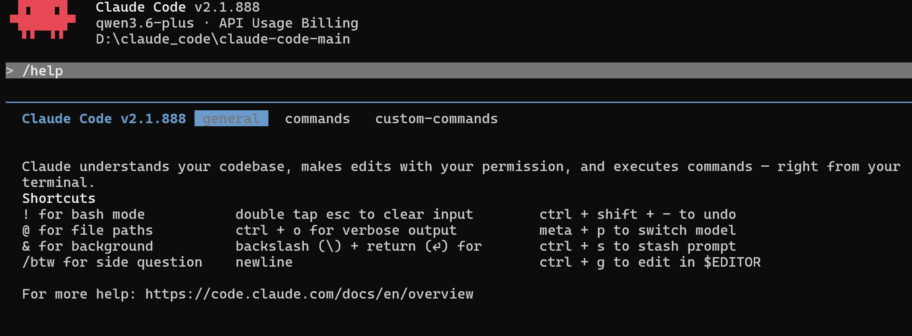

事情是这样的。

我之前短时间使用过claude code，但是并没有完全深度使用，因为还是不太习惯命令行操作风格所以短暂使用就放弃了。日常的开发学习中，我主要还是在用TRAE和Qoder多一些，但是网上博主都在使用claude code，所以我也开始试着深入体验一下。

随着我使用的时间增加，我开始发现claude code的一些优势。
在这里分享一下claude code的相关内容。从前几周开始，我将cc作为我首要编程工具，目前使用的时Claude Code + qwen3.6-pius和kimi-2.6。接下来我也会继续将claude作为我日常开发中的一个首要使用工具。深入学习Claude Code相关操作。

以下是我使用claude code的一些经验和感悟吧，分享给目前只听过claude code还没有具体使用的朋友们。

---

## 先搞清楚它是什么

Claude Code本质上是一个命令行工具，你通过它来跟Claude对话，但它收到的不是普通的聊天内容，而是你的项目上下文。它能看到你的代码结构、文件内容、git历史，甚至能直接操作你的文件系统。

安装方式很简单，官方文档有详细说明，国内各大模型开发者平台都有对应的安装配置命令。或者github上有大牛基于前些时候claude泄露源码反编译逆向还原的项目。这里给大家分享个。
https://github.com/claude-code-best/claude-code 

启动也简单，在你的项目目录下直接运行`claude`命令就行，它会自动分析项目结构，然后你就可以开始对话了。

第一次用的时候你可能会有点懵，感觉跟普通的AI聊天也差不多啊。别急，魔法在后头。

---

## 入门第一课：把它当成一个实习生

用Claude Code最重要的一个心态，就是把它当成一个靠谱的实习生。

什么意思？

你跟实习生说话不会怎么说？「去把那个用户模块里的登录逻辑重构一下，要求用策略模式，别破坏现有功能。」不会说「帮我优化一下用户体验」。前者够具体，实习生知道要做什么，后者太模糊，实习生只能站在原地发呆。

Claude Code也是这样。

你给它的指令越具体，它做得越准确。你说「帮我看看这个文件有什么问题」，它可能会给你一顿分析，但你说「这个函数在处理并发请求时会race condition，帮我找到并修复」，它直接动手干活。

所以我看到很多人吐槽Claude Code不好用，我就想问，你真的说清楚你要什么了吗？

坦率的讲，我觉得prompt能力才是用好Claude Code的核心，这个比任何技巧都重要。

---

## 核心命令：最重要部分

好，正式进入正题。

Claude Code有一套自己的命令系统，以斜杠开头，这些是它最基础的能力。

### `/help` 别看不起这个

我知道很多人看到help命令就跳过，觉得我又不是新手，看什么帮助文档。

但我跟你说，Claude Code的`/help`是我见过最良心的帮助文档之一。它不只是告诉你有哪些命令，还会给出每个命令的使用示例，甚至会告诉你一些最佳实践。

我每次学新东西都喜欢先过一遍help文档，不是说我不会，而是有时候你以为你会的那个东西，其实有更骚的用法。

你想想看，你用一个工具用了很久，结果发现有个功能你之前压根不知道，那多亏。

### `/clear` 让对话重新开始

这个命令用于清除当前对话历史，重新开始。

有时候你跟Claude Code聊着聊着，上下文已经乱成一团了，它开始重复自己说的话，或者开始跑偏话题。这个时候不要硬撑着继续，直接`/clear`，你们重新开始。

我自己的习惯是，每完成一个独立的任务就clear一次。比如我让它帮我重构完一个模块，ok，任务完成，clear，然后下一个任务再开新的对话。

这样上下文干净，它也不会被之前的内容带跑。

### `/model` 换个模型试试

Claude Code支持切换不同的模型。不同的模型擅长的事情不一样，有时候你发现Claude突然不会了，别急着骂它，可能是模型的问题，换一个试试。

这个命令可以让你在多个模型之间切换，找到最适合你当前任务的那个。

### `/compact` 压缩上下文

这个命令很多人不知道，但非常实用。

跟 `/clear` 直接清空对话不同，`/compact` 会压缩当前对话的上下文，保留关键信息但减少对话长度。当对话变得很长、Claude开始表现下降时，用它比直接 `/clear` 更温和。

我自己的习惯是，对话进行到一半但还不想丢失上下文时，用 `/compact` 给对话"瘦身"。

### `/undo` 撤销操作

Claude Code改错代码了？不用慌，用 `/undo` 可以撤销它最近的文件修改。

这个命令会回退Claude Code上一步对文件系统的更改。配合 `/review` 使用效果更佳——先看看它改了什么，不满意就 `/undo`。

### `/review` 审查变更

这个命令可以查看Claude Code最近做了哪些修改。

在让Claude Code完成一堆改动后，先 `/review` 检查一下，确认没问题了再继续。这个习惯很重要，不要盲目相信AI的每一次修改。

### `/config` 配置设置

用这个命令可以查看和修改Claude Code的配置选项。

比如你可以设置默认的模型、调整权限策略、配置代理等等。想深度定制Claude Code的行为，这个命令是入口。

### `/summarize` 总结对话

当对话很长、内容很多时，用 `/summarize` 让Claude帮你总结当前对话的要点。

这个功能在长时间开发后特别有用，你出去喝杯水回来，可能已经忘了刚才讨论到哪了，用它帮你快速回忆上下文。

### `/resume` 恢复对话

如果你不小心关闭了Claude Code，或者想继续之前的工作，可以用 `/resume` 恢复之前的对话会话。

---

## 文件操作

Claude Code最强大的地方，就是它能直接操作你的文件。

你让它改代码，它真的去改文件，不是给你一段代码让你自己复制粘贴。这一点太重要了，这意味着你可以从「问它怎么做」直接跳到「让它帮你做」。

### 读文件

你可以通过几种方式让它读取文件。

最直接的就是在对话里直接提到文件名，比如「帮我看看`src/utils/auth.ts`这个文件」。它会自动读取并分析。

也可以用`@`语法来引用文件，比如`@src/utils/auth.ts`，这种方式的优点是可以同时引用多个文件，让它对比着看。

我特别想说的是这个`@`语法，真的是一个被很多人忽略的利器。

你想啊，你跟它聊一个bug，但你不告诉它具体是哪个文件，它只能靠猜。但如果你把相关文件都`@`给它，它直接看到真实代码，结论会准很多。

### 写文件和编辑文件

这是重点。

Claude Code对文件的操作有两种模式：一种是直接写新文件，一种是编辑现有文件。

写新文件很简单，你告诉它文件名和内容，它就创建了。但编辑现有文件才是真正考验它能力的地方。

它默认会用`Edit`工具来修改文件，所谓的Edit就是精准定位然后替换。这个能力说实话现在各家AI编程工具都在做，但Claude Code的编辑准确率是我用过最高的。

当然也不是百分百准确，尤其当你让一次改太多东西的时候，它有时候会漏掉一些。所以我自己的习惯是，大改化小，先让它改一部分，你确认没问题了，再让它改下一部分。

不要一次性丢给它一个巨大的重构任务让它全部搞定，这种事情再强的AI也容易翻车。

---

## Bash命令

Claude Code能执行Bash命令，这个能力太重要了。

你说「帮我运行一下npm run build」，它真的去执行，然后告诉你编译结果。你说「帮我git commit一下」，它真的去做。你说「启动一下开发服务器」，它真的去启动。

这就是我说的「亲自下场」的能力，不是给你一个命令让你自己复制粘贴，而是直接帮你执行。

执行命令的时候有几个点需要注意。

第一，首次执行敏感命令（比如`rm -rf`或者修改系统配置）它会先问你确认。这个安全机制挺好的，至少不会让你手滑删库跑路。

第二，命令执行的结果它会显示在对话里，但如果命令运行时间很长，你可以看到实时输出。这个对于跑测试、启动开发服务器这种场景特别有用。

第三，有时候你让它执行一个命令，它会先解释一下它要做什么，然后再执行。这是好事，说明它在思考，不是傻乎乎的直接干。

---

## Claude Code的内部工具

Claude Code对整个项目的理解能力来自于它内部自带的一系列工具。

**注意**：这里提到的工具是Claude Code**自主使用**的，不是你直接在命令行输入的命令。你在对话中描述需求，Claude Code会根据需要自动调用这些工具来完成任务。理解这些工具的存在，能帮你更好地跟它沟通。

### 代码搜索工具

Claude Code有类似 `grep` 的文本搜索能力，也有更强大的语义搜索能力。

普通的文本搜索你肯定知道是什么，搜"login"就找到所有包含login的文件。但语义搜索是你用自然语言描述你想找的东西，它帮你定位。

比如你说"帮我找到处理用户权限验证的代码"，它不是搜"权限验证"这四个字，而是真的理解你想找什么，然后告诉你应该在哪个文件、哪个函数里。

这种能力在做大型项目的时候特别爽。你接手一个陌生的代码库，想找某个功能的实现，语义搜索比你自己翻目录找快多了。

不过我得说，语义搜索也不是万能的，它有时候会理解偏你的意思。这种时候你可以明确告诉它"用精确文本匹配搜一下某某关键字"，它就会切换到文本搜索模式。

### 文件读取工具

Claude Code能直接读取你的文件内容，这是它能理解项目的基础。

当你用 `@` 语法引用文件时，它底层调用的就是文件读取工具。但即使你不显式引用文件，它在需要的时候也会主动读取相关文件来理解上下文。

### 网页抓取工具

Claude Code还有个内部工具可以抓取网页内容。

这个能力怎么用呢？比如你在开发中遇到了一个奇怪的问题，社区上有个帖子可能有用，但你懒得打开浏览器去看。直接给它链接，让它帮你抓取分析，然后告诉你结论。

或者你想了解某个开源项目的最新动态，直接给它项目主页的链接，它帮你总结。

用多了你就会发现，这个工具能让你的开发流程少切换多少次浏览器。

### 主动提问

很多人不知道的是，Claude Code其实会主动提问的。

当它觉得你给的信息不够的时候，它会问你问题来澄清。这不是它的缺点，恰恰说明它在认真思考你的任务。

我之前见过有人吐槽，说Claude Code总是问来问去的，很烦。我就问他，你觉得是它问清楚再做对，还是不做清楚就瞎做对？

他说那肯定是要问清楚啊。

我说那不就得了。

当然，如果你发现它问的问题你之前已经说过了，或者它理解错了你的意思，那可能是上下文太长了，`/clear` 或者 `/compact` 重新来。

---

## Git操作：commit、branch、diff等等

Claude Code对Git的支持也挺好。

你让它「帮我看看当前有哪些更改」，它会执行`git status`和`git diff`，把变更展示给你看。

你让它「帮我commit」，它会先问你commit message写什么，然后执行`git add`和`git commit`。

你想看某个分支的提交历史，它也能帮你查。

甚至你想创建新分支、切换分支、合并分支，这些它都能做。

我平时用Git的频率很高，这个能力真的帮我省了不少事。以前commit的时候我要先`git status`看一眼，改了哪些文件，然后`git add`，然后写message。现在直接「帮我提交这些更改」，一句话搞定。

当然，`/help`一下可以看看Git相关的所有能力，有时候会有惊喜。

---

## 进阶用法：目的是让Claude更懂你

好了，上面说的是基础操作，接下来聊点进阶的。

### CLAUDE.md 如何让它更懂你的项目

这是我认为Claude Code非常重要的功能。

你可以创建一个`CLAUDE.md`文件在项目根目录，这个文件里的内容会被自动加载到每个对话的上下文中。你可以在里面写项目的技术栈、代码规范、常用的操作流程、甚至一些特定的约定。

比如你可以写「我们项目里所有的API调用都放在`src/api`目录下」，或者「数据库模型统一用TypeScript的interface而不是class」。

这样每次对话它都知道你的项目长什么样，不用你每次都重复解释。

我见过很多人抱怨Claude Code不理解他们的项目，但从来没人提过这个功能。我想说，你都没告诉它你的项目是什么，它怎么可能理解呢。

### .claude/ 目录

除了`CLAUDE.md`，Claude Code还会读取项目根目录下的`.claude/`目录。

这里面可以放各种配置文件，比如`settings.json`用来设置默认行为，`commands/`目录可以定义自定义命令。

这个功能适合深度用户，你想让Claude Code完全按照你们团队的规范来工作，就得靠这个目录来配置。

### 权限管理

Claude Code有一套权限系统，这是很多人忽略但非常重要的功能。

当Claude Code要执行敏感操作（比如删除文件、运行某些命令、修改系统配置）时，它会先弹窗问你确认。这时候你有几个选项：

- **Allow once**：仅这次允许
- **Always allow**：永远允许这类操作
- **Deny**：拒绝

我自己的习惯是，对于`git status`、`git diff`这种只读命令，直接设置`Always allow`，省得每次都要点确认。但对于`rm`、`git push`这种危险操作，一定要保持每次确认。

权限配置也可以在`.claude/`目录下通过配置文件预设，这样团队协作的时候大家的权限策略就统一了。

### 多轮对话

Claude Code是一个多轮对话工具，但多轮对话也有讲究。

我见过两种极端。一种是每句话都当做一个全新的任务，不给任何上下文。另一种是打开一个对话就不停了，从项目启动聊到需求评审，从代码风格聊到职业规划。

这两种都有问题。

我的经验是，以任务为边界来划分对话。一个完整的任务——比如重构一个函数、修复一个bug、添加一个功能——就放在一个对话里。任务完成，`/clear`，下一个。

这样每个对话的上下文都是干净的，Claude Code不会因为上下文太长而开始重复自己或者跑偏。

---

## 实战场景

说了一堆功能，有人可能会问，这玩意到底能帮我干什么实事？

好问题。我来说说我的日常使用场景。

**读代码**。面对一个陌生的代码库，让它帮我快速理解结构。或者某个同事写的代码我看不懂，直接丢给它让它给我讲。

**写代码**。不是让它替我写整个功能，而是让它帮我实现某个具体的函数或者逻辑。我说我需要什么，它写出来我看，不满意就改。

**改bug**。把报错信息丢给它，或者把出问题的代码给它，让它帮我分析。有时候我自己要花半小时debug的问题，它一秒就找到原因了。

**写测试**。这个我必须重点提一下，我之前特别讨厌写测试，但现在有了Claude Code，痛苦程度降低了很多。给它一个函数，它帮你生成测试用例，覆盖率直接拉满。

**重构**。告诉它你要用的设计模式，让它帮你重构现有代码。我用它重构过策略模式、观察者模式、工厂模式，省了很多机械劳动。

**写文档**。代码写完了让它帮忙生成API文档，或者补充注释。它能看懂代码，写的文档质量也还行。

**翻译**。我之前维护一个项目，代码里全是中文注释，突然要转英文，直接让它帮我翻译，比我自己改快多了。

---

## 坑和教训

说了这么多正向的使用经验，我也想聊聊我踩过的坑。

**第一，不要让它一次做太多事。**

这是最大的教训。我之前喜欢一次性给它一个大任务，「帮我把这个模块从Java重构成TypeScript，同时改掉所有的命名规范，还要确保测试全部通过」。

结果呢，要么是它中途跑偏了，要么是改出来的东西有各种小问题需要回头修。

现在的原则是，大任务拆小，分步骤来，每步确认了再下一步。慢一点，但稳很多。

**第二，不要完全相信它的第一次回答。**

它很强，但也会犯错。尤其是在一些边界条件的处理上，它可能会漏掉一些case。所以重要的逻辑一定要自己再review一遍。

我不是说它不可信，而是说在使用AI编程工具的时候，保持代码owner的心态很重要——最终代码的责任还是你的，不是它的。

**第三，注意上下文长度。**

对话太长的时候，它的表现会下降。表现为开始重复自己说的话，或者开始遗漏一些之前提到的要求。

解决办法就是及时`/clear`，保持上下文干净。

---

Claude Code不是一个能替代你思考的工具，但它是一个能让你思考的时候不被dirty work打断的工具。

你把那些机械的、重复的、有明确输入输出的任务丢给它，然后你自己去做真正需要创造力的事情。

磨平一些信息差，也磨平一些重复劳动。

这就是工具该有的样子。

> / 作者：剑桥折刀

