# Codex接入DeepSeek完全指南：绕过OpenAI限制的黄金组合

## 一、为什么要搞这套组合？

你是不是也被 OpenAI Codex 种草了？这个能读懂整个项目、自动写代码、改 Bug、跑测试，甚至能独立工作好几小时的 AI 编程神器，确实让人心动。但国内开发者想用上它，门槛可不是一般的高：

1. **登录门槛**：需要 OpenAI 账号，国内手机号根本注册不了。
2. **网络门槛**：就算搞到账号，网络卡成 PPT，动不动就超时断开。
3. **费用门槛**：想充 API？要么被风控，要么价格贵到肉疼，用几天就几十块没了。

同样的使用量，OpenAI 官方 GPT-4o 的输入价格高达 35 元/百万 Tokens，输出更是 105 元/百万 Tokens。而 DeepSeek 的输入只要 1 元/百万 Tokens，输出 2 元/百万 Tokens，**价格差了近 20 倍**！

所以，今天我们要做的，就是给 Codex 换个"大脑"——用 DeepSeek 替代 OpenAI 官方 API，全程不用梯子，国内网络直接跑满速。

> **特别注意**
> 这套方案的核心原理是**协议转换**，不是破解版，也不是盗版。Codex 只是前端交互外壳，模型后端换成了 DeepSeek，体验上几乎无差别。
> 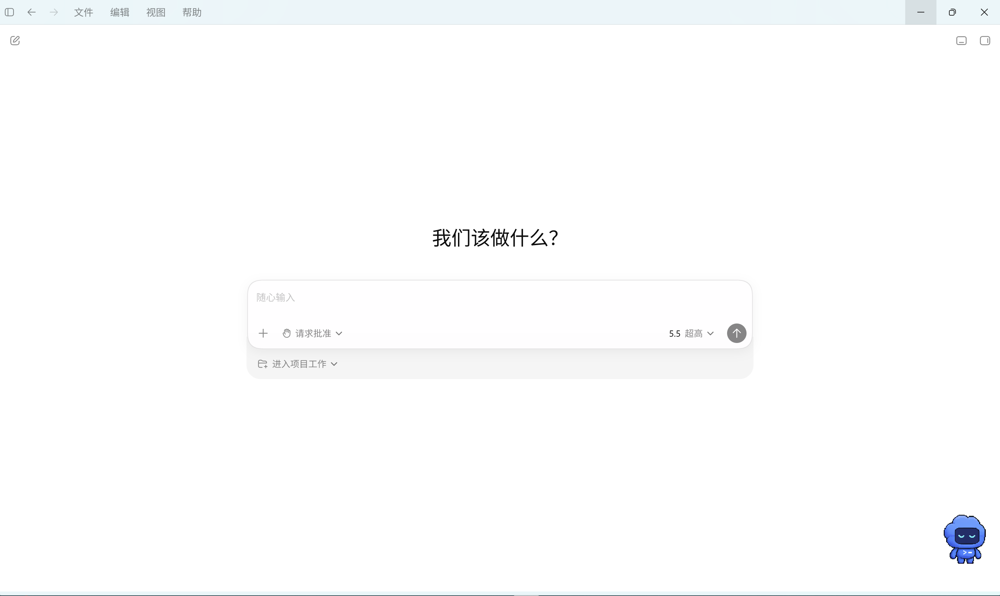

## 二、核心原理：为什么 Codex 不能直接连 DeepSeek？

在动手之前，你得先明白为什么不能直接改个 Base URL 就完事。因为 Codex 和 DeepSeek 说的是两种完全不同的"语言"：

| 对比项    | Codex 原生 (Responses API) | DeepSeek (Chat Completions API) |
| ------ | ------------------------ | ------------------------------- |
| 请求路径   | `/v1/responses`          | `/v1/chat/completions`          |
| 请求格式   | 包含 `input` 字段            | 包含 `messages` 数组                |
| 响应格式   | `output` 数组，每项带 `type`   | `choices` 数组，含 `message`        |
| 工具调用结构 | Responses API 内部结构       | `tool_calls` 字段                 |
| 流式事件格式 | 事件类型名称不同                 | SSE 事件以 `data:` 前缀传输            |

简单来说，Codex 说"法语"，DeepSeek 说"英语"，直接对话谁也听不懂谁。你需要一个"翻译官"——在本地跑一个协议转换层，把 Codex 发出的 Responses API 请求实时翻译成 DeepSeek 能听懂的 Chat Completions 请求，再把响应翻译回去。

这就是 EchoBird 的核心工作：**协议转换 + 配置注入**。
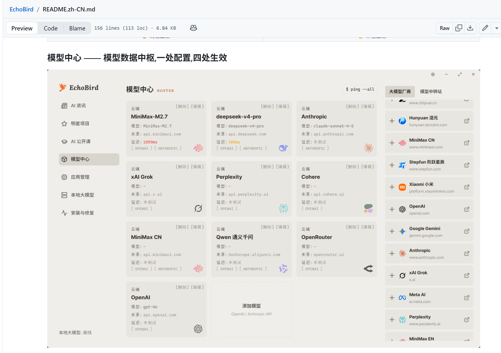

## 三、准备工作

在开始配置之前，你需要准备以下两样东西：

1. **DeepSeek API Key(或者其它厂商的apikey)**
   - 访问 <https://platform.deepseek.com/>
   - 用手机号注册登录，点击左侧「API Keys」
   - 点击「Create new API Key」，生成一个新的密钥
   - **这个 Key 只显示一次，立刻复制保存好！**
2. **EchoBird**
   - 访问 <https://echobird.ai/> 下载对应系统的安装包
   - 或者访问git仓库地址[edison7009/EchoBird](https://github.com/edison7009/EchoBird)
   - 一路下一步安装即可

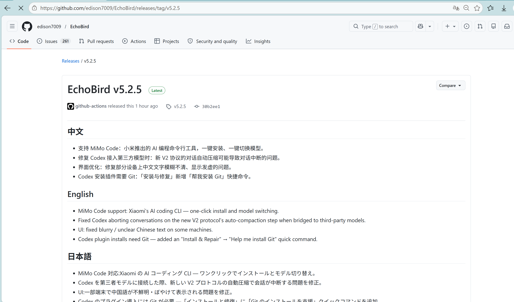

## 四、配置 EchoBird

### 4.1 添加 DeepSeek 模型

1. 打开 EchoBird，点击左侧的「模型中心」。
2. 点击「添加模型」，填写以下信息：
   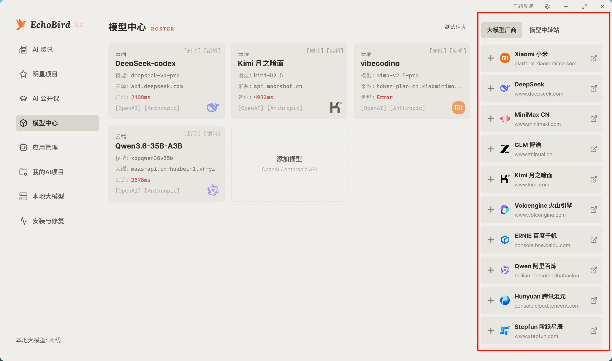
   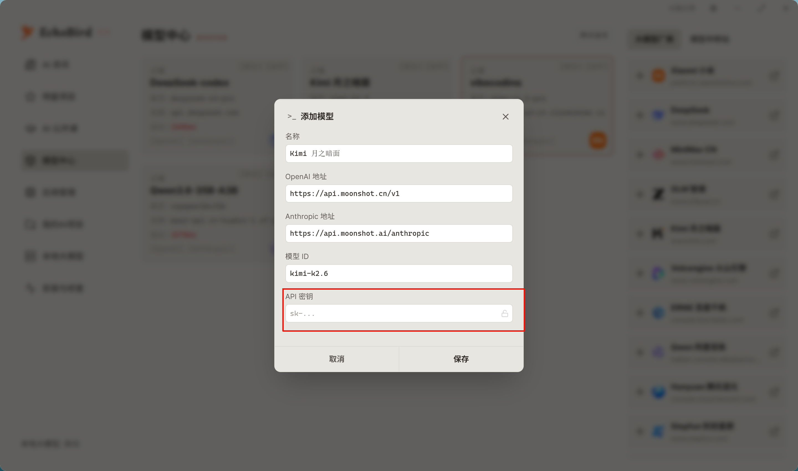

| 配置项      | 值                          |
| -------- | -------------------------- |
| 名称       | DeepSeek（随便填）              |
| Base URL | `https://api.deepseek.com` |
| API Key  | 你刚才复制的 DeepSeek API Key    |
| 模型 ID    | `deepseek-v4-pro`          |
| 协议       | **OpenAI API**             |

填完点保存，这一步就搞定了！

### 4.2 模型选择建议

| 模型                  | 特点                   | 适用场景         |
| ------------------- | -------------------- | ------------ |
| `deepseek-v4-flash` | 通用对话，速度快、性价比高        | 日常代码编写、问答、重构 |
| `deepseek-v4-pro`   | 带推理链，思考更深但 Token 消耗大 | 复杂逻辑推理、算法设计  |

## 五、启动 Codex

配置好 EchoBird 后，启动顺序非常关键：

1. **先启动 EchoBird**
2. **在 EchoBird 中点击启动 Codex**
   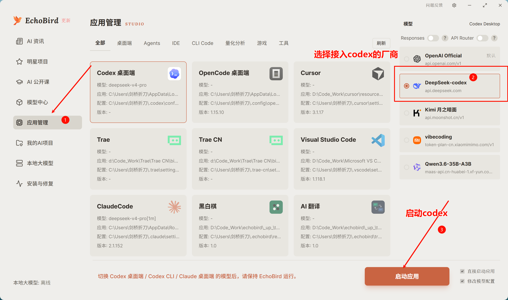
   EchoBird 会自动完成以下事情：

- 启动本地协议转换服务
- 将 DeepSeek 配置注入 Codex
- 绕过 OpenAI 登录校验

> **特别注意**
> 不要直接点击原来的 Codex 快捷方式启动！如果绕过 EchoBird，Codex 会尝试连接 OpenAI 官方服务器，导致登录弹窗或网络错误。

## 六、验证接入成功

启动完成后，你可能会发现 Codex 界面右下角仍然显示 "OpenAI / GPT"，是不是没成功？
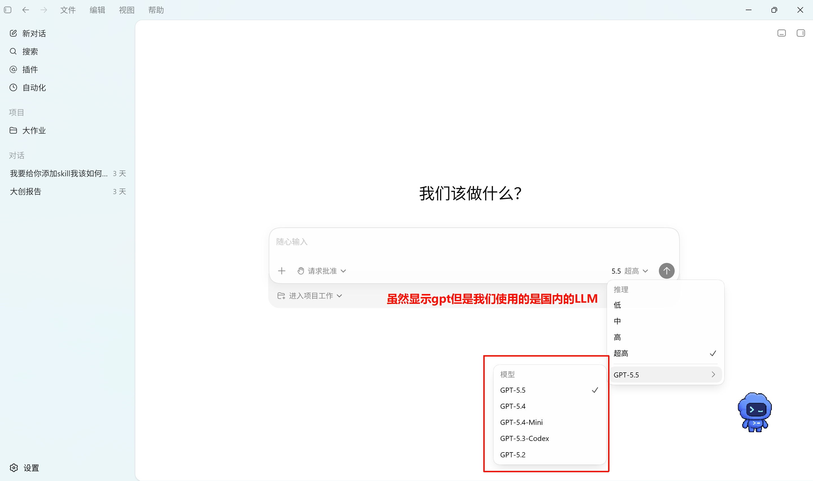
**这是正常现象。** Codex 界面显示的模型名是本地 UI 状态，不会因为代理转发而改变。正确的验证方式是：

1. **看网络**：Codex 运行时不再请求 OpenAI 域名，而是走本地代理。
2. **看费用**：DeepSeek 控制台能看到 API 调用记录和 Token 消耗。
3. **看效果**：直接输入提示词，如果能正常返回代码且**没有弹出 OpenAI 登录窗口**，就说明成功了！
   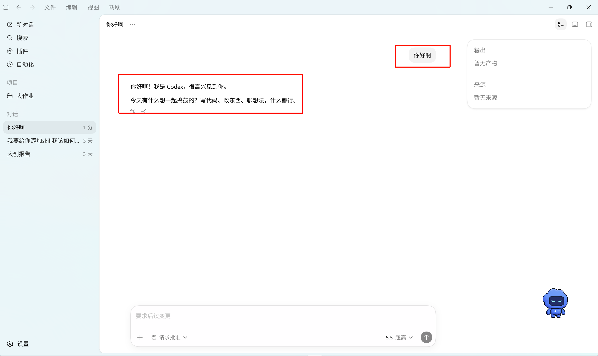

## 七、常见问题与排坑

### 7.1 Codex 启动后仍弹出 OpenAI 登录窗口

说明 Codex 没有被正确注入配置。检查以下几点：

- 确认是通过 EchoBird 启动的 Codex，而不是原快捷方式。
- 确认 EchoBird 中的模型配置已保存且状态正常。
- 尝试重启 EchoBird，再重新启动 Codex。
  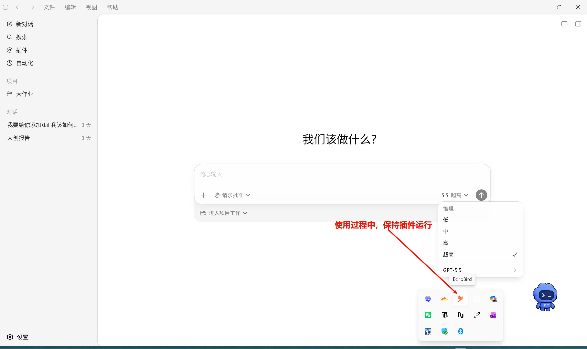
  而且插件也是能使用的。
  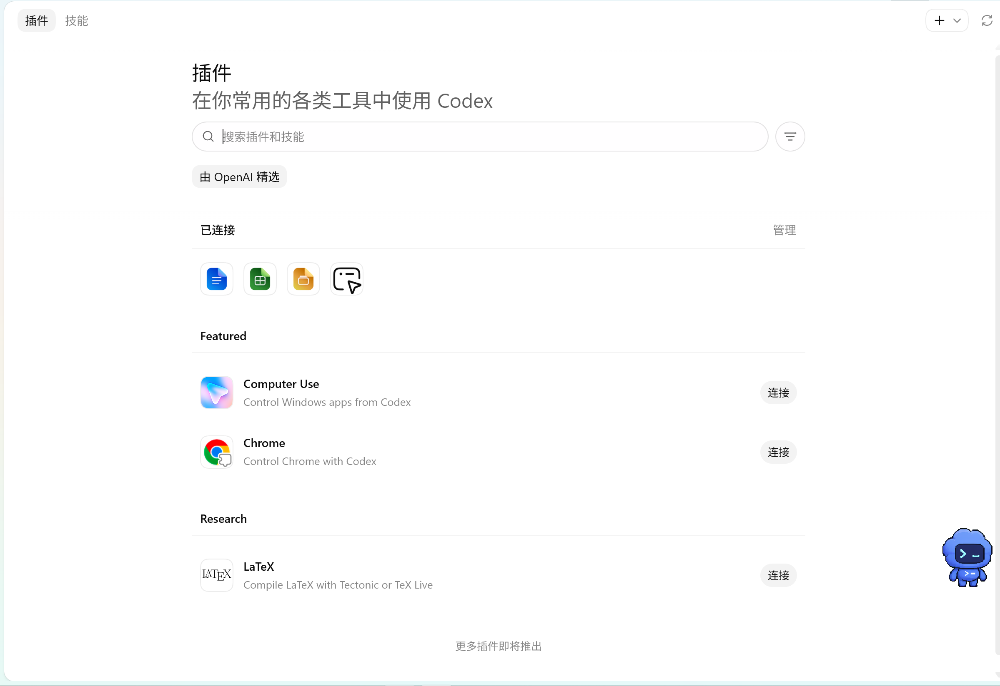

### 7.2 返回代码很慢或超时

- 检查本地网络是否稳定。
- 在 EchoBird 中切换不同的 DeepSeek 模型试试，比如从 `deepseek-reasoner` 换成 `deepseek-chat`。
- DeepSeek 高峰期可能出现延迟，属于正常现象。

### 7.3 模型选择建议

| 场景        | 推荐模型                | 理由         |
| --------- | ------------------- | ---------- |
| 日常编码、快速迭代 | `deepseek-v4-flash` | 速度快，价格低    |
| 复杂算法、深度推理 | `deepseek-v4-pro`   | 思考更充分，质量更高 |

 

## 八、使用体验

下面是我最近的使用体会。我分别用 Trae Solo 的 Work 模式和 Codex 来续写实验报告，目标是从原来的 30 页扩展到 40 页以上。

### 8.1 Trae Solo Work 模式

我把 30 页的附件报告丢给 Trae Solo，要求扩写到 40 页，其中必须包含流程图和表格对比。可能是因为报告太长，它最终失败了，只交付了一个 6 页的报告。

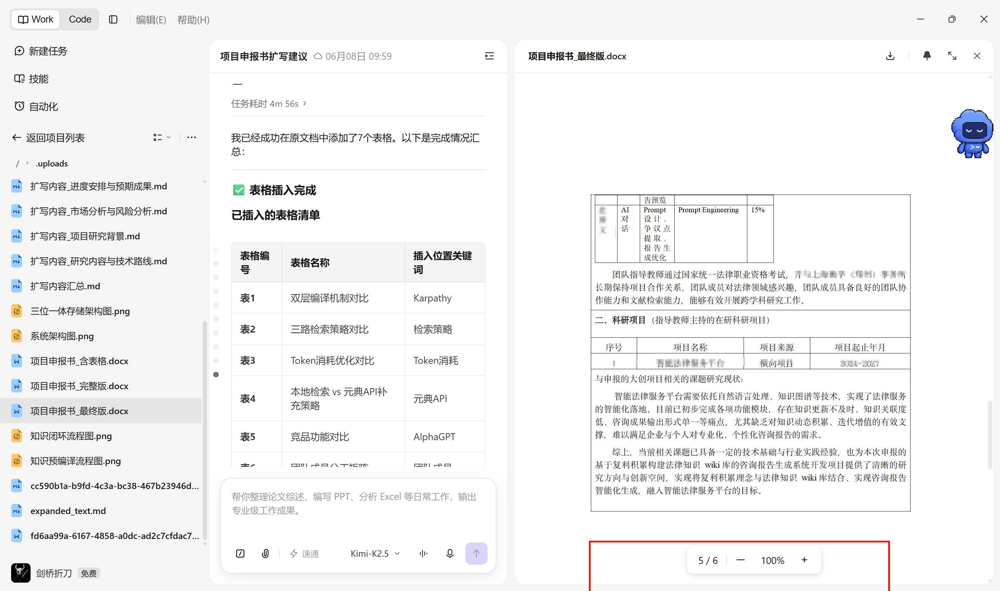

### 8.2 Codex 文档续写

然而 Codex 的文档排版效果非常好，几乎做到了直接使用。下面是 Codex 生成的 40 页以上 Word 报告，格式严格按照我的提示词要求完成，系统架构图和功能流程图都画得很完善。

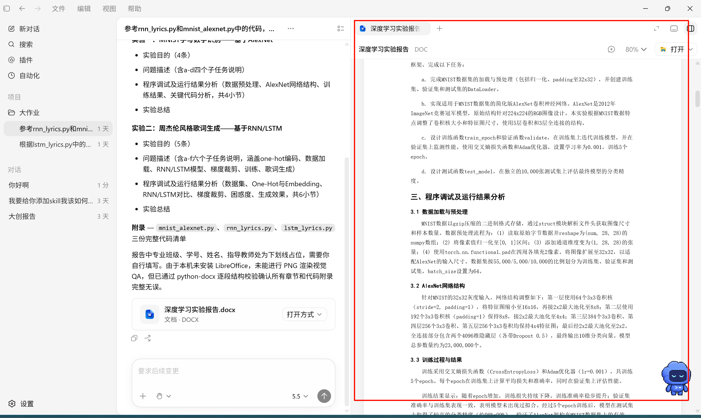

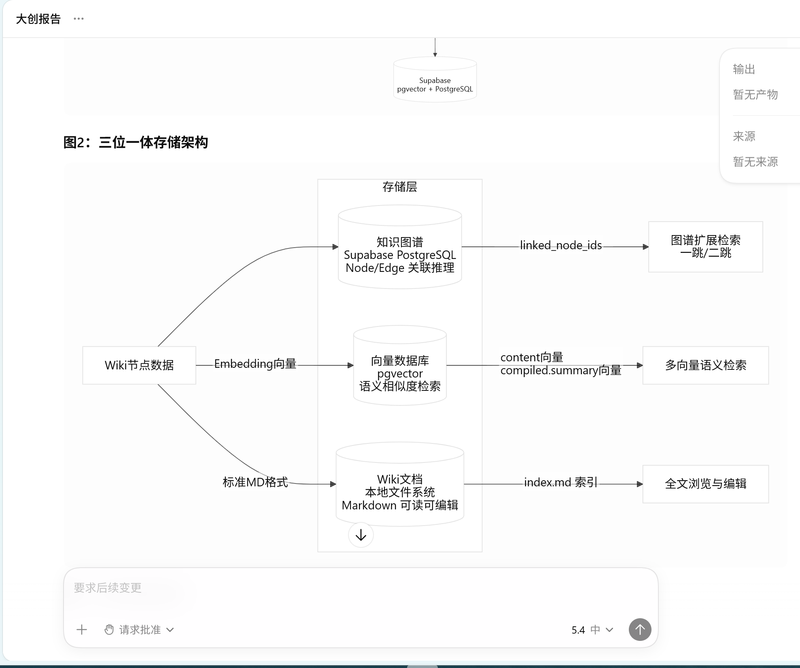

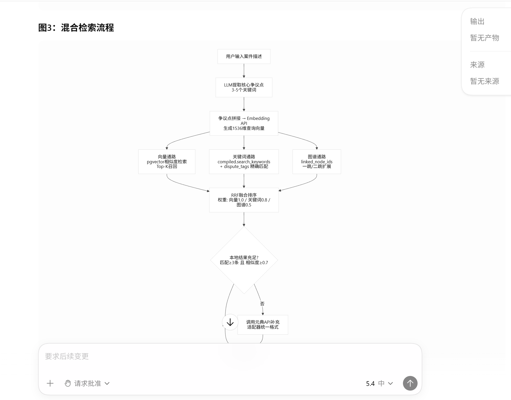

## 九、总结

通过 EchoBird + DeepSeek 的组合，你成功实现了：

- **零 OpenAI 账号**：跳过所有登录校验和风控。
- **国内网络直连**：不用梯子，延迟低且稳定。
- **成本降低 20 倍**：DeepSeek API 价格极具竞争力。
- **保留原生体验**：Codex 的交互、快捷键、功能全部保留。

核心逻辑就是一句话：**EchoBird 负责协议转换和配置注入，DeepSeek 负责提供便宜好用的模型能力**。配置一次，后续只需打开 EchoBird 点击启动即可，非常方便。

如果你在配置过程中遇到其他问题，欢迎在评论区留言，我会持续更新这篇指南。
