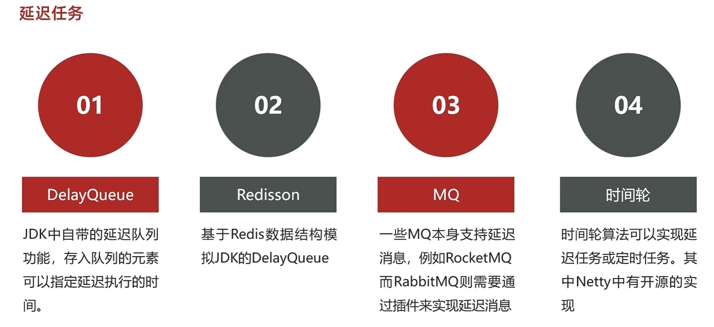

# Java实现延迟任务的四种方案：从DelayQueue到时间轮算法

在业务开发中，延迟任务（Delayed Task）是处理"**现在不做，等一会儿再做**"这类需求的核心手段。它主要用于解耦业务流程、提升系统响应速度以及保证数据的最终一致性。

简单来说，就是当业务逻辑不需要立即执行，或者需要等待特定条件满足后才执行时，此时就会用到延迟任务。例如：在开发中我们经常会遇到这样的需求：**"在这个时间点做某事"或者**"等待一段时间后做某事"。比如订单超时取消、退款处理、定时提醒等。

今天我们就来通过代码实战，介绍一下 Java 中实现延迟任务的四种主流方案。

### 1. JDK 原生方案：DelayQueue

这是最基础、门槛最低的方案，完全依赖 JDK，不需要第三方中间件。它适合单机环境下的轻量级任务。

#### 核心原理

`DelayQueue` 是一个无界阻塞队列，只有在延迟时间到了之后，才能从队列中取出元素。它内部使用了 `ReentrantLock` 和 `Condition` 实现线程安全。

#### 代码落地

首先，我们需要定义一个任务类，实现 `Delayed` 接口，并重写 `getDelay` 方法。

**Java 中** **`DelayQueue`** **的核心运作原理：**`DelayQueue` 元素**必须实现** **`Delayed`** **接口**，必须重写 `getDelay(TimeUnit unit)` 方法，用来返回**剩余延迟时间**。同时 `Delayed` 接口**继承自** **`Comparable`**， 必须重写 `compareTo` 方法，用来**按剩余延迟时间排序**， 从队列取元素时：**只有到期的任务才能被取出**，没到期的拿不到。

以例子理解原理：

我们把 `DelayQueue` 比作一个"智能快递柜"**，那么这段文字就是在讲:**"什么样的包裹能放进这个柜子"**以及**"柜子怎么决定先给谁开门"**。所以任何想放入这个队列的任务（我们可以比喻成**"包裹"**），都必须实现** **`Delayed`** **接口。然后用接口中的**`getDelay`\*\*方法，获取队列中剩余任务的延迟时间，查看是否快到期，是否需要紧急处理。

同时`Delayed` 接口其实继承了 `Comparable` 接口。这意味着，放进来的任务不仅要会"报时"，还得会"攀比"，我们实现compareTo方法，它会根据 `compareTo` 方法的逻辑，自动把任务排好序。`getDelay` 返回时间**最短**（最着急）的任务，会被排在队列的最前面（堆顶）。

**代码案例：**

```Java
@Data
public class DelayTask <D>implements Delayed {
    private D data;// 延迟任务的数据,指定一个泛型，没有具体类型，可传任何类型。
    private long deadlineNanos; // 延迟任务的截止时间

    // 构造函数，指定延迟任务的数据和 计算一下延迟时间=当前时间+延迟时间，单位纳秒
    public DelayTask(D data, Duration delayTime) {
        this.data = data;
        this.deadlineNanos = System.nanoTime() + delayTime.toNanos();
    }
    /**
     * 获取延迟时间
     * @param unit 时间单位
     * @return 延迟时间
     */
    @Override
    public long getDelay(@NotNull TimeUnit unit) {
        // 计算每个任务的开始执行时间-当前时间，单位纳秒 最小为0不能为负值
        //再用时间转化器转换成指定单位的时间
        return unit.convert(Math.max(0, deadlineNanos - System.nanoTime()), TimeUnit.NANOSECONDS);
    }

    /*
      --比较队列中的延迟时间大小，小的比较急先执行。
      getDelay(TimeUnit.NANOSECONDS)：获取当前任务还需要等待多久才能执行（剩余延迟时间），单位是纳秒。
      o.getDelay(...)：获取另一个任务还需要等待多久。
     
    */
    /**
     * 避免数据溢出，实际工程版本
     * @param o the object to be compared.
     * @return
     */
    @Override
    public int compareTo(@NotNull Delayed o) {
        // 这种方式更安全，避免了数值溢出问题
        return Long.compare(
                this.getDelay(TimeUnit.NANOSECONDS),
                o.getDelay(TimeUnit.NANOSECONDS)
        );
    }
    /**
     * 比较两个延迟任务的延迟时间--方便理解版本：两者的差值。
     * @param o 延迟任务
     * @return 延迟时间
     */
     
   /* @Override
    public int compareTo(@NotNull Delayed o) {
        long l = getDelay(TimeUnit.NANOSECONDS) - o.getDelay(TimeUnit.NANOSECONDS);
        if(l>0){   //我要等得更久，所以我优先级更低，我应该排在后面。
            return 1;
        }else if(l<0){//我等的时间短，快到期了，所以我优先级更高，我应该排在前面（先被执行）。
            return -1;
        }else{
            return 0;//意味着两者的延迟时间相等。
        }
    }*/
}

```

**优缺点总结：**

- **优点**：零依赖，代码简单，JDK 原生支持。
- **缺点**：**单机内存存储**。服务重启任务丢失；集群部署时，任务无法共享（任务在 A 机器，B 机器消费不到）。

### 2. 分布式方案：Redisson

为了解决单机问题，我们利用 Redis 的 `ZSet` 结构。`Redisson` 框架对 Redis 进行了封装，提供了非常好用的分布式延迟队列。

#### 核心原理

利用 Redis `ZSet` 的 `score` 存储任务的执行时间戳。消费者不断轮询 `ZSet`，这里是"基于 Redis 的 Sorted Set 特性，通过后台任务扫描到期任务，不是客户端在死循环查数据库，取出 `score` 小于当前时间的任务进行处理。

#### 代码落地

引入依赖 `redisson-spring-boot-starter`。

**代码案例**

```Java
import org.redisson.api.RBlockingQueue;
import org.redisson.api.RDelayedQueue;
import org.redisson.api.RedissonClient;
import org.springframework.stereotype.Component;
import javax.annotation.PostConstruct;
import javax.annotation.Resource;
import java.util.concurrent.TimeUnit;
@Component
public class RedissonDelayQueue {

    @Resource
    private RedissonClient redissonClient;

    @PostConstruct
    public void startQueue() {
        // 1. 定义一个阻塞队列
        RBlockingQueue<String> blockingQueue = redissonClient.getBlockingQueue("order_queue");
        
        // 2. 基于阻塞队列构建延迟队列
        RDelayedQueue<String> delayedQueue = redissonClient.getDelayedQueue(blockingQueue);

        // 3. 启动消费者监听
        new Thread(() -> {
            while (true) {
                try {
                    // take() 会阻塞等待，只有当延迟时间到了，元素才会从 delayedQueue 转移到 blockingQueue
                    String orderId = blockingQueue.take();
                    System.out.println("【Redisson消费】执行订单关闭：" + orderId);
                } catch (InterruptedException e) {
                    e.printStackTrace();
                }
            }
        }).start();

        // 4. 模拟生产任务 (延迟 5 秒)
        delayedQueue.offer("Order_1001", 5, TimeUnit.SECONDS);
        System.out.println("【Redisson生产】订单 Order_1001 已加入，5秒后执行");
    }
}
```

**优缺点总结：**

- **优点**：支持分布式，数据持久化在 Redis，可靠性高。
- **缺点**：依赖 Redis；基于轮询实现，如果任务量极大，可能会有微小的延迟或 Redis 压力。

### 3. 消息中间件方案：RocketMQ

这是企业级开发最常用的方案。利用 MQ 的消息机制，让 Broker 帮我们管理延迟。

#### 核心原理

发送消息时指定 `delayTimeLevel`。消息到达 Broker 后，不会直接投递给消费者，而是先存入一个特殊的"延迟主题"中，时间到了再转存到真实主题供消费者消费。

#### 代码落地

这里以 RocketMQ 为例（RabbitMQ 需配合插件或死信队列，逻辑类似）。

**生产者：**

```Java
import org.apache.rocketmq.client.producer.DefaultMQProducer;
import org.apache.rocketmq.client.producer.SendResult;
import org.apache.rocketmq.common.message.Message;

public class MqProducer {
    public static void main(String[] args) throws Exception {
        DefaultMQProducer producer = new DefaultMQProducer("producer_group");
        producer.setNamesrvAddr("localhost:9876");
        producer.start();

        Message msg = new Message("OrderTopic", "OrderTag", "Order_2023", "Hello RocketMQ".getBytes());
  
     //设置延迟等级：3级代表 10秒 (RocketMQ 的默认延迟等级通常是：1s 5s 10s 30s 1m 2m 3m 4m 5m 6m 7m 8m 9m 10m 20m 30m 1h 2h。)
        msg.setDelayTimeLevel(3); 

        SendResult sendResult = producer.send(msg);
        System.out.println("【MQ生产】发送成功，结果：" + sendResult);
        
        producer.shutdown();
    }
}
```

**消费者：**

```Java
import org.apache.rocketmq.client.consumer.DefaultMQPushConsumer;
import org.apache.rocketmq.client.consumer.listener.ConsumeConcurrentlyContext;
import org.apache.rocketmq.client.consumer.listener.ConsumeConcurrentlyStatus;
import org.apache.rocketmq.client.consumer.listener.MessageListenerConcurrently;
import org.apache.rocketmq.common.message.MessageExt;

public class MqConsumer {
    public static void main(String[] args) throws Exception {
        DefaultMQPushConsumer consumer = new DefaultMQPushConsumer("consumer_group");
        consumer.setNamesrvAddr("localhost:9876");
        consumer.subscribe("OrderTopic", "*");

        consumer.registerMessageListener((MessageListenerConcurrently) (msgs, context) -> {
            for (MessageExt msg : msgs) {
                System.out.println("【MQ消费】收到消息：" + new String(msg.getBody()) + 
                                   "，实际消费时间：" + System.currentTimeMillis());
            }
            return ConsumeConcurrentlyStatus.CONSUME_SUCCESS;
        });

        consumer.start();
        System.out.println("【MQ消费】消费者启动");
    }
}
```

**优缺点总结：**

- **优点**：高可靠，高吞吐，解耦。支持海量任务堆积。
- **缺点**：架构复杂，运维成本高；RocketMQ 的延迟等级是固定的（除非定制），不如 Redisson 灵活。

### 4. 高性能算法方案：时间轮 (HashedWheelTimer)

如果你需要处理**超高频、低延迟**的任务（比如心跳检测、连接超时），上面几种方案可能太重了。这时候需要用到"时间轮"算法。Netty 和 Kafka 内部都使用了这种算法。

#### 核心原理

像一个时钟表盘。有很多个"槽"（Slot），每个槽代表一个时间间隔。指针转动，转到哪个槽，就执行哪个槽里的任务。

#### 代码落地

这里直接使用 Netty 提供的 `HashedWheelTimer`。

```Java
import io.netty.util.HashedWheelTimer;
import io.netty.util.Timeout;
import io.netty.util.TimerTask;

import java.util.concurrent.TimeUnit;

public class TimeWheelDemo {
    public static void main(String[] args) {
        // 1. 创建时间轮
        // tickDuration=1, unit=SECONDS -> 每1秒指针走一格
        // ticksPerWheel=8 -> 表盘有8个槽
        HashedWheelTimer timer = new HashedWheelTimer(1, TimeUnit.SECONDS, 8);

        System.out.println("提交任务...");

        // 2. 提交任务 (延迟 5秒)
        timer.newTimeout(new TimerTask() {
            @Override
            public void run(Timeout timeout) throws Exception {
                System.out.println("【时间轮】任务执行：连接超时检查");
            }
        }, 5, TimeUnit.SECONDS);
        
        // 保持程序运行，否则主线程退出，定时器也会关闭
        try { Thread.sleep(10000); } catch (InterruptedException e) {}
    }
}
```

**优缺点总结：**

- **优点**：**性能极高**。增加任务的时间复杂度是 O(1)，非常适合每秒百万级的超时任务（如网络连接空闲检测）。
- **缺点**：精度取决于 tickDuration；任务是在内存中，不支持持久化（进程挂了任务就没了）。


