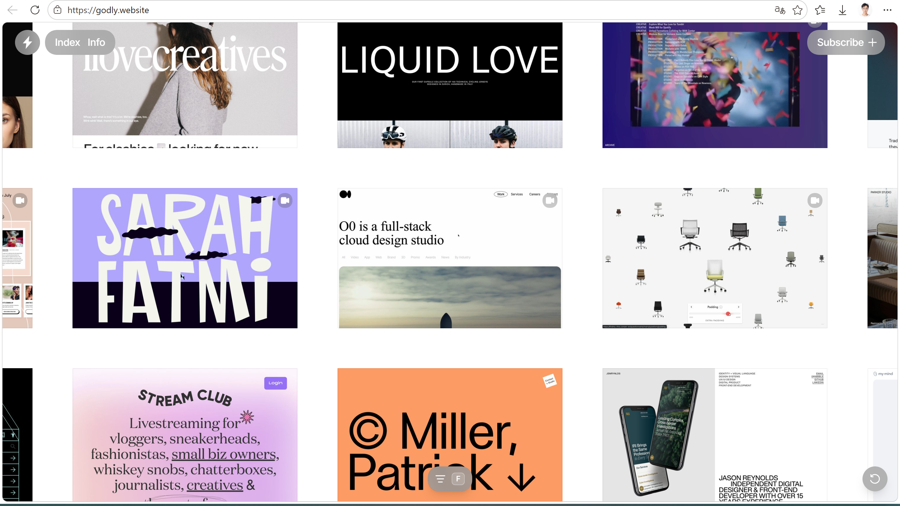
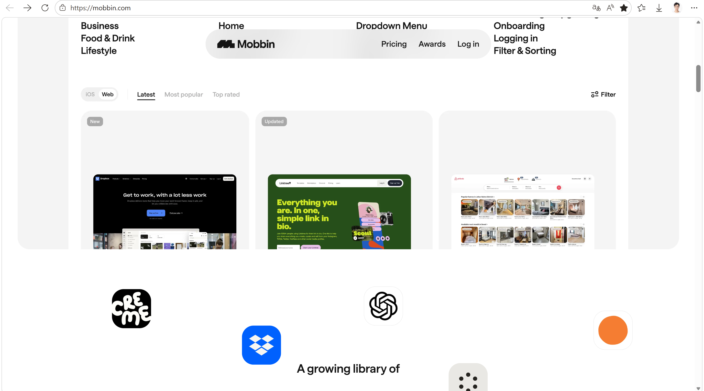
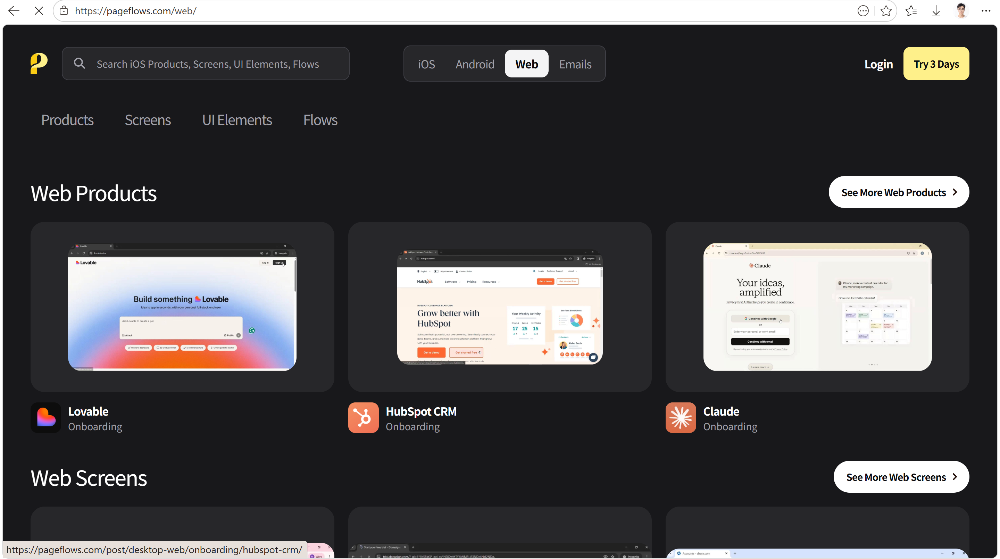
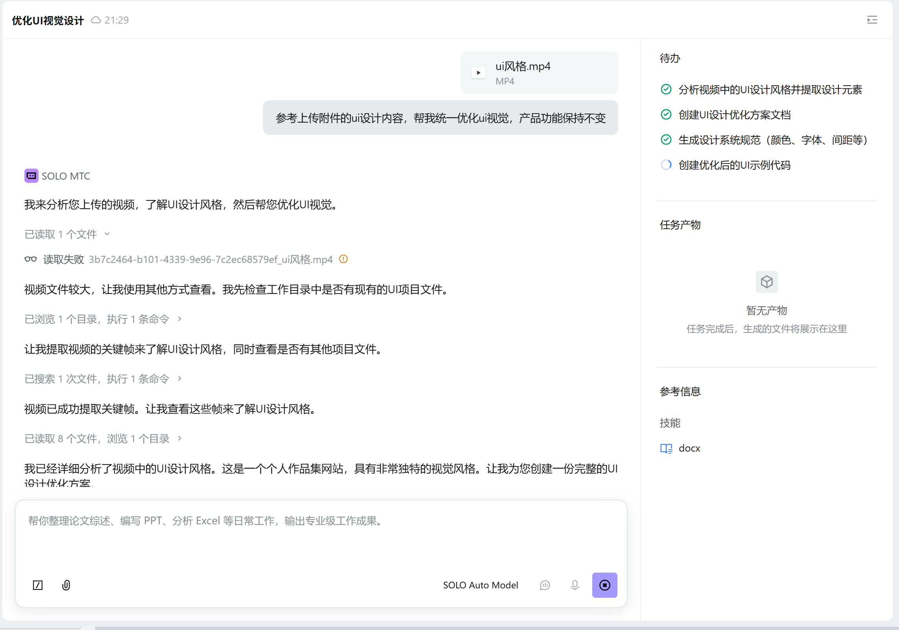
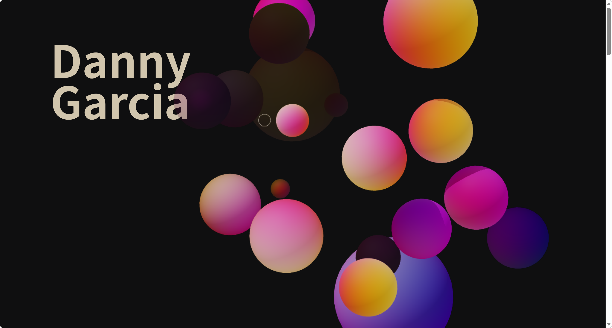
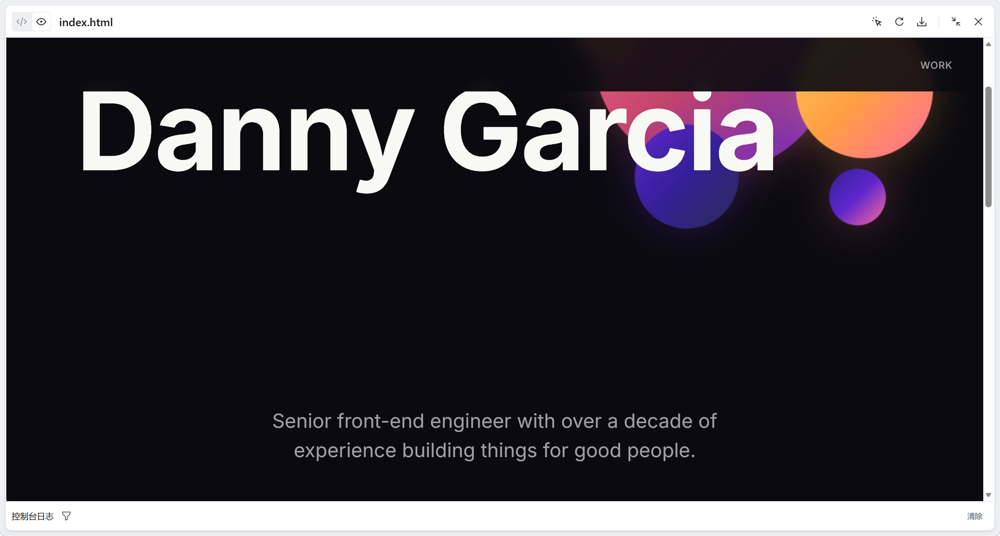
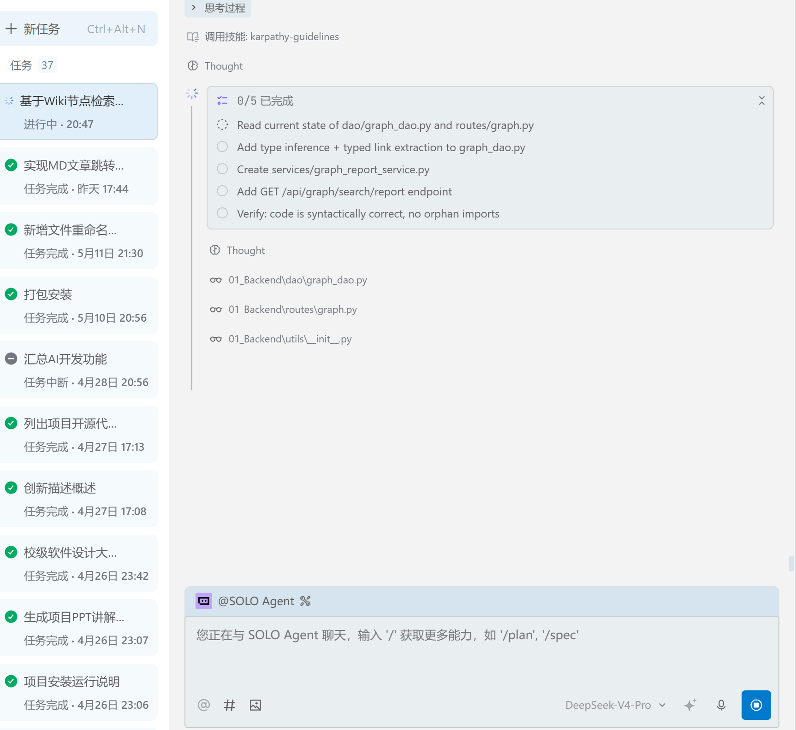
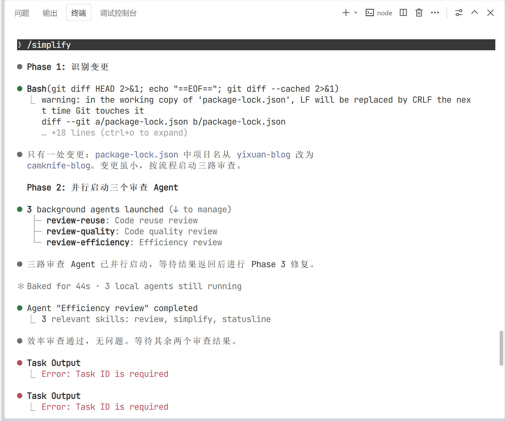

***

title: 个人Vibe\_Coding开发流程总结
date: 2026-05-08
categories:

- AI工具
- 开发效率
  tags:
- Vibe Coding
- AI编程
- 开发流程
- TRAE
- Claude Code
  author: 剑桥折刀

***

# Vibe Coding 开发流程总结

> **核心理念**：AI时代，用好AI工具。

***

## 一、开发流程总览

```
灵感 → 原型 → 开发 → 审查 → 沉淀
```

***

## 二、各阶段详解

### 1.1 灵感阶段

| 维度       | 内容                      |
| -------- | ----------------------- |
| **灵感来源** | 推文、技术分享视频、大牛博客          |
| **主要工具** | TRAE SOLO、Claude Code   |
| **核心任务** | 项目报告分析 + 技术可行性评估        |
| **对话深度** | 清楚项目核心目标、模块数量、页面交互、功能按钮 |
| **关键原则** | 先抓住核心功能，不必一次性确定全部开发内容   |
| **输出产物** | PRD 产品需求文档              |

***

### 1.2 原型阶段

| 维度       | 内容                                             |
| -------- | ---------------------------------------------- |
| **主要任务** | 确定项目开发报告，设计多种实现思路                              |
| **工作方式** | 不断修改、反复沟通                                      |
| **开发策略** | 分阶段开发                                          |
| **版本管理** | 每一版项目开发文档强制保存，方便回档和功能迭代                        |
| **原型生成** | TRAE SOLO 的 MTC 模式                             |
| **推荐工具** | Google Stitch（可以使用Google生态）、墨刀（国内）、TRAE MTC 模式 |
| **输出产物** | PRD + 项目开发文档 + 完整页面原型                          |

#### 1.2.1 UI设计网站推荐

[Godly - Astronomically good web design inspiration](https://godly.website/)



[Mobbin — UI & UX design inspiration for mobile & web apps](https://mobbin.com/)



[UI/UX Design Inspiration & User Flows from Top Apps — Page Flows](https://pageflows.com/)



这里我们直接截屏整理页面、或者录屏交给我们的 Agent 工具让他帮我们复刻整个效果。

提示词："参考上传附件的ui设计内容，帮我统一优化ui视觉，产品功能保持不变"



我想要的效果动态的效果，气泡随着鼠标移动：



TRAE SOLO MTC模式生成效果没有动态效果，但是整体效果模仿我认为够用：



***

### 1.3 开发阶段

#### 1.3.1 技术方案选择

| 方案  | 工具链                                                                                  |
| --- | ------------------------------------------------------------------------------------ |
| 方案一 | Google Stitch → Google AI Studio（直接导入生成代码）                                           |
| 方案二 | TRAE SOLO + Claude Code + GLM 5.1 / Kimi K2.6 / DeepSeek V4 Pro（使用 CC-switch 一键切换厂商） |



#### 1.3.2 开发建议

| 建议       | 说明                       |
| -------- | ------------------------ |
| **起步建议** | 第一个AI项目先使用纯Web前端，不涉及后端服务 |
| **渐进策略** | 后续逐步尝试增加后端逻辑             |
| **版本控制** | 必须进行GitHub仓库托管，修改失败方便回退  |
| **开发准则** | 小步迭代，开发一点测试一点            |

#### 1.3.3 后端开发工具推荐

- Claude Code
- TRAE IDE + 终端 Claude
- Cursor + 终端 Claude/Si

***

### 1.4 审查阶段

| 维度       | 内容                    |
| -------- | --------------------- |
| **审查方式** | AI审查AI（换一个AI工具进行代码评估） |
| **工具搭配** | TRAE写的代码 → 用Claude审查  |
| **审查重点** | 可优化点、潜在问题             |
| **自我要求** | 重点流程自己要清楚用什么技术实现      |



***

### 1.5 沉淀阶段

| 维度        | 内容            |
| --------- | ------------- |
| **工作流汇总** | 整理个人开发工作流     |
| **封装复用**  | 常用功能封装成 Skill |
| **知识输出**  | 汇总成博客、开源仓库    |

***

## 三、核心理念：如何"用好"AI

### 3.1 错误认知

> 把需求丢给AI然后复制粘贴？不关心代码逻辑。

**后果**：丧失技术判断力，一旦AI生成的代码出现深层Bug或安全漏洞，将非常麻烦。

### 3.2 正确认知

> 真正的"用好"，核心在于 **Code Review（代码审查）**

AI生成的代码可能存在：

- 过度工程化
- 逻辑隐患
- 安全漏洞

**未来需要积累的能力**：一眼看出AI代码"哪里不对劲"——这需要技术积累。

***

## 四、完整工作流公式

```
拆解需求 → 设计架构 → 指导AI生成 → 严格审核 → 优化落地
```

***

## 五、工具矩阵汇总

| 阶段   | 推荐工具                                     |
| ---- | ---------------------------------------- |
| 灵感分析 | TRAE SOLO                                |
| 原型设计 | Google Stitch、墨刀、TRAE MTC 模式             |
| 前端开发 | Google AI Studio、TRAE SOLO + Claude Code |
| 后端开发 | Claude Code、TRAE IDE、Cursor              |
| 模型切换 | GLM 5.1、Kimi K2.6、DeepSeek V4 Pro        |
| 版本控制 | GitHub                                   |
| 代码审查 | Claude（审查TRAE代码）                         |

***

## 六、关键经验总结

| 经验         | 说明               |
| ---------- | ---------------- |
| **分阶段开发**  | 降低复杂度，便于管理       |
| **强制保存版本** | 方便回档和功能迭代        |
| **小步迭代**   | 开发一点，测试一点        |
| **AI审查AI** | 换工具交叉验证          |
| **技术积累**   | 保持对核心流程的技术理解     |
| **知识输出**   | 封装Skill、写博客、开源分享 |

***

