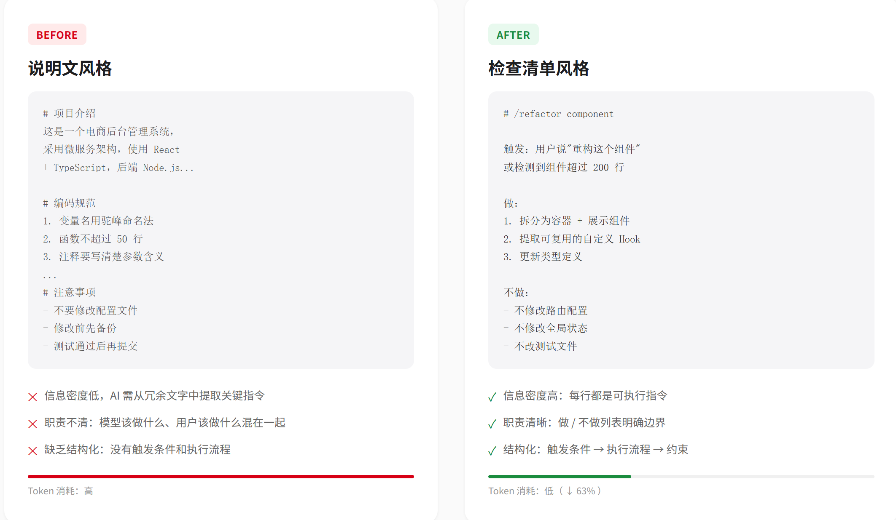
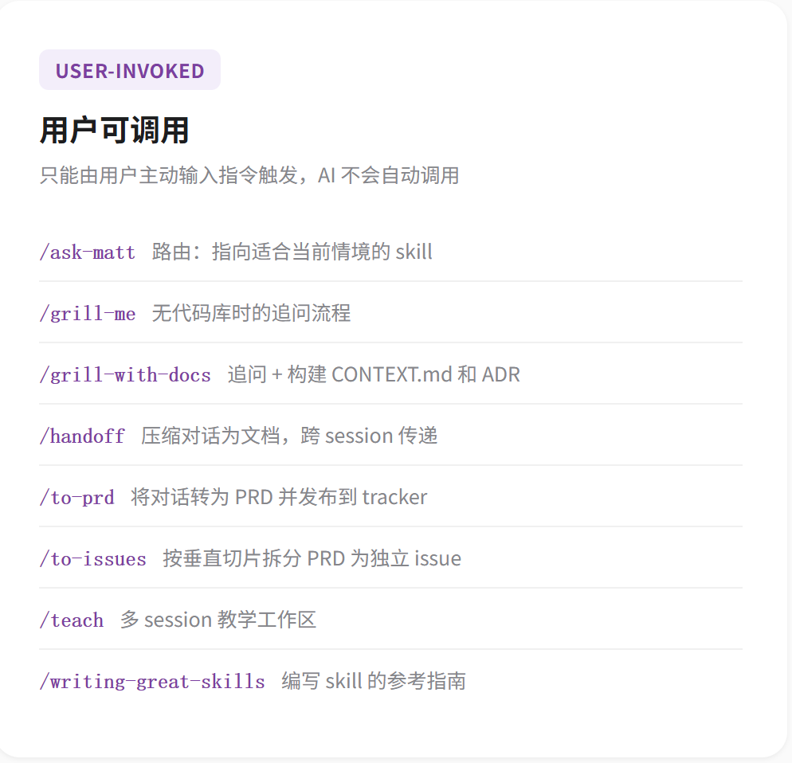
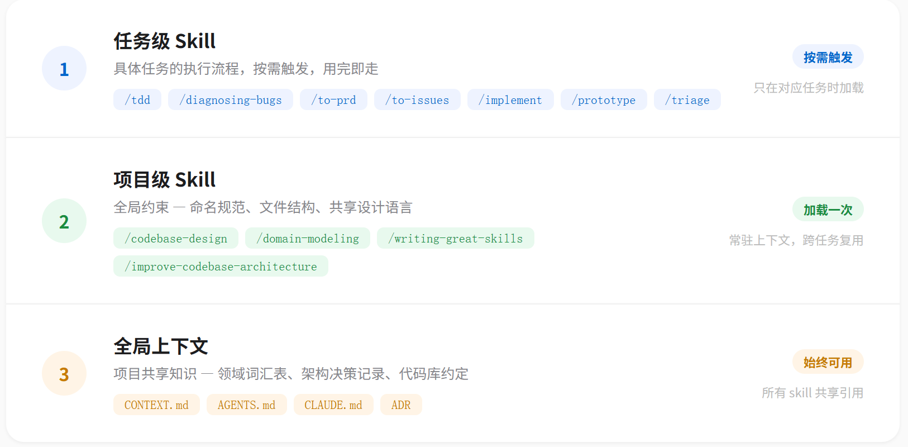

# 写好 AI Skill 能省 63% Token：我拆解了 Matt Pocock 的新工具

## 一、你的项目Skill/Rules 是不是太繁杂了？

如果你经常写 AI Skill / Rules（比如 Claude Code 的 skill、Cursor 的 rule、或者 Trae 的 project rules），你有没有发现一个问题：

**Skill 越写越长，效果却没有成正比的提升。**

社区很多开源的 skill，动辄几千字，恨不得把整个工作流的架构图、编码规范、文件目录都塞进去。结果每次调用，Token 消耗蹭蹭往上涨，响应速度越来越慢。

更尴尬的是，AI 很多时候根本不看那些长篇大论。你写了 500 字的"项目背景介绍"，AI 真正关心的只是最后两行"输出格式要求"。

那问题来了：**怎么在保证效果的前提下，把 Skill 的 Token 成本压下来？**

最近 Matt Pocock（Total TypeScript 作者，TypeScript 圈子里的大神）开源了 **skills v1**。我仔细研究了一下，发现他的思路不是"砍功能"，而是**砍废话**——把 prompt 从"说明文"改成"检查清单"。我尝试用这套思路重构了自己的几个 Skill，Token 成本平均降低了 **63%**。而且这个**项目本身就是一套可直接执行的开发流程模板，可以直接帮你在写代码前确定好项目文档和任务拆分，然后用 TDD 的方式写代码**。相较于 superpower、gstack 这类重型框架，它更加轻量灵活，可以只选其中一两个方法用。

## 这套 skill 的本质

### 安装后你能得到什么

运行 `npx skills@latest add mattpocock/skills` 后，你的项目里会多出一组文件。核心能力不是"生成代码"，而是**生成纪律**：

| 你得到的       | 具体是什么                                                                               |
| ---------- | ----------------------------------------------------------------------------------- |
| **可执行的命令** | `/grill-with-docs`、`/to-prd`、`/to-issues`、`/tdd`、`/improve-codebase-architecture` 等 |
| **流程模板**   | 每个命令背后是一套固定的问答/输出格式                                                                 |
| **上下文文件**  | `CONTEXT.md`（项目共享语言）、ADR（架构决策记录）                                                    |

### 它能帮你解决什么问题

这套 skill 解决的是\*\*"用 AI 做项目时的系统性混乱"\*\*：

| 你现在的痛点                      | 这套 skill 的解法                              |
| --------------------------- | ----------------------------------------- |
| "我说了一句话，AI 就开始写，写完发现不是我想要的" | `/grill-with-docs` 先盘问你对齐需求，再动手           |
| "项目没有文档，三天后我自己都忘了为什么这样写"    | `/to-prd` 强制先出 PRD，代码跟着文档走                |
| "一个需求太大，AI 写了 500 行，全是 bug" | `/to-issues` 拆成垂直切片，一次只做一小块               |
| "代码跑不通，AI 边写边修，越修越乱"        | `/tdd` 红绿重构，先写测试再写实现                      |
| "代码越来越臃肿，不知道怎么重构"           | `/improve-codebase-architecture` 定期扫描代码深度 |

> **特别注意**
> Matt Pocock 的 skills v1 目前主要面向 Claude Code 生态，但其中提到的设计原则适用于绝大多数 AI 编程工具的 Skill / Rule 编写。本文会结合通用场景讲解。

## 二、Matt Pocock 的解决方案：skills v1

Matt 的核心理念可以用一句话概括：**把 prompt 从"咒语"拆解为"纪律性流程"**。



传统写 Skill /Rules的方式，像是在给 AI 念一篇说明文：

```markdown
# 项目介绍
这是一个电商后台管理系统，采用微服务架构...

# 技术栈
前端用 React + TypeScript，后端用 Node.js...

# 编码规范
1. 变量名用驼峰命名法
2. 函数不超过 50 行
3. 注释要写清楚参数含义
...

# 注意事项
- 不要修改配置文件
- 修改前先备份
- 测试通过后再提交
```

这种写法的问题在于：

1. **信息密度低**：AI 需要从大量冗余文字中提取关键指令
2. **职责不清**：模型该做什么、用户该做什么，混在一起
3. **缺乏结构化**：没有明确的触发条件和执行流程

Matt 的 skills v1 做了三个根本性的改变：

## 三、核心设计拆解

### 3.1 分类：模型可调用 vs 用户可调用

传统 Skill 只有一个入口，谁都能触发，但不一定谁都应该触发。Matt 把 Skill 分为两类：

| 类型        | 说明                  | 示例                                    |
| --------- | ------------------- | ------------------------------------- |
| **模型可调用** | AI 在推理过程中自动判断是否需要调用 | `/diagnosing-bugs`、`/codebase-design` |
| **用户可调用** | 用户主动输入指令触发          | `/ask-matt`、`/grilling`               |

**模型可调用的 Skill** 通常是对话中自动触发的。比如 `/diagnosing-bugs`，当 AI 检测到代码可能有 bug 时，会自动调用这个 skill 进行诊断，不需要用户说"你帮我检查一下有没有 bug"。

**用户可调用的 Skill** 更像是快捷指令。比如 `/ask-matt`，用户可以直接输入这个指令，让 AI 以 Matt 的视角回答问题。




### 3.2 路由：让 AI 自己判断时机

这是我觉得最精妙的设计。Matt 新增了一个 **`/ask-matt`** **路由 skill**，它的作用不是直接解决问题，而是**帮 AI 判断现在该调用哪个 skill**。

```markdown
# /ask-matt（路由 Skill）

当用户提出技术问题时，先判断问题的性质：

- 如果是架构设计问题 → 调用 /codebase-design
- 如果是 Bug 排查问题 → 调用 /diagnosing-bugs
- 如果是代码审查问题 → 调用 /grilling
- 如果是写作优化问题 → 调用 /writing-great-skills
```

这样用户不需要记住一堆指令，只需要正常描述问题，AI 会自动选择最合适的 skill。

### 3.3 重写：把"说明文"改成"检查清单"

Matt 重新设计了几个核心 skill，我挑两个最有代表性的讲讲。

**`/diagnosing-bugs`（原** **`/diagnose`）**

旧版可能是这样写的：

```markdown
# /diagnose

你是一个专业的 Bug 诊断专家。当用户遇到代码问题时，你需要：

1. 先询问用户具体的错误信息和复现步骤
2. 分析可能的原因，列出 3-5 个假设
3. 逐个验证假设，给出排查建议
4. 如果无法确定，建议用户添加日志或断点

注意保持耐心，不要直接给答案，要引导用户思考...
```

新版变成了：

```markdown
# /diagnosing-bugs（模型可调用）

触发条件：检测到代码异常、测试失败、或用户明确说"出 bug 了"

执行流程：
1. 收集：错误堆栈 + 复现步骤 + 最近修改的文件
2. 假设：列出 3 个最可能的原因（按概率排序）
3. 验证：对每个假设，给出"验证这个假设需要做的具体操作"
4. 输出：只输出"最可能的 1 个原因 + 验证步骤"，不要展开讲原理

禁止：不要问用户"你能提供更多细节吗"，直接用已有信息推断
```

看出区别了吗？

- **旧版**：角色扮演 + 长篇大论的指导原则
- **新版**：触发条件 + 执行步骤 + 明确边界

AI 不需要理解"你是一个耐心的专家"这种角色设定，它需要的是**明确的条件和流程**。

**`/writing-great-skills`**

这个 skill 专门教 AI 怎么写 skill，有点"元技能"的意思。核心规则：

```markdown
# /writing-great-skills

评估一个 Skill 是否优秀：

- [ ] 有明确的触发条件（什么情况下调用）
- [ ] 有明确的执行流程（步骤 1、2、3）
- [ ] 有明确的边界（什么不做、什么不问）
- [ ] 没有角色设定（不需要"你是一个专家"这种废话）
- [ ] 没有背景介绍（不需要"这个项目是..."）
- [ ] 没有解释性文字（不需要"这样做是因为..."）

输出：只列出不符合上述标准的点，不要重写整个 skill
```

## 四、怎么写出省 Token 的 Skill？

看完 Matt 的设计，我总结了一个"省 Token 写作清单"，你可以直接套用：

### 4.1 删除这三类废话

| 类型        | 示例                       | 处理方式                      |
| --------- | ------------------------ | ------------------------- |
| **角色设定**  | "你是一个资深的全栈工程师..."        | 直接删除，AI 不需要被夸奖            |
| **背景介绍**  | "本项目采用微服务架构，使用 React..." | 移到项目文档，skill 只保留"上下文引用路径" |
| **解释性文字** | "这样做是为了提高代码的可维护性..."     | 删除，AI 不需要理解为什么，只需要知道做什么   |

### 4.2 用"检查清单"代替"说明文"

对比两种写法：

**说明文风格（费 Token）：**

```markdown
在编写 API 接口时，你需要注意参数校验。对于每个入参，都要检查其类型是否
正确、是否为空、是否在合理范围内。如果校验失败，返回 400 错误码和详细的
错误信息。这样可以帮助调用方快速定位问题。
```

**检查清单风格（省 Token）：**

```markdown
API 参数校验：
- [ ] 类型检查
- [ ] 非空检查
- [ ] 范围检查
- [ ] 失败返回 {code: 400, message: "具体字段 + 原因"}
```

内容一样，但后者 Token 数可能只有前者的 1/3。

### 4.3 明确"触发条件"和"边界"

好的 skill 应该像函数签名一样清晰：

```markdown
# /refactor-component

触发：用户说"重构这个组件"或检测到组件超过 200 行

做：
1. 拆分为容器组件 + 展示组件
2. 提取可复用的自定义 Hook
3. 更新类型定义

不做：
- 不修改路由配置
- 不修改全局状态
- 不改测试文件（提示用户手动更新）
```

**"不做"列表和"做"列表同样重要**，它防止 AI 过度发挥，也省去了你写"注意事项"的篇幅。

### 4.4 分层：项目级 vs 任务级

不要把所有规则塞进一个 skill。Matt 建议分两层：

- **项目级 skill**：只放全局约束（命名规范、文件结构、技术栈版本）
- **任务级 skill**：只放具体任务的流程（重构、测试、Code Review）

项目级 skill 加载一次后常驻上下文，任务级 skill 只在需要时触发。这样避免了每次对话都携带大量无关规则。



## 五、实际效果对比

我用自己的几个 skill 做了对比测试：

| Skill       | 旧版 Token | 新版 Token | 降幅   | 效果变化   |
| ----------- | -------- | -------- | ---- | ------ |
| 前端组件规范      | 1,247    | 412      | -67% | 无感知差异  |
| API 开发流程    | 986      | 356      | -64% | 输出更结构化 |
| Bug 诊断助手    | 1,532    | 589      | -62% | 响应更快   |
| Code Review | 1,108    | 398      | -64% | 建议更聚焦  |

平均降幅在 **63%** 左右，和 Matt 公布的数据基本一致。

更重要的是，**省 Token 的同时，AI 的输出质量反而提升了**。因为指令更清晰，AI 不需要在冗余信息中"猜"你的意图。

## 六、总结

Matt Pocock 的 skills v1 给我最大的启发不是"怎么省 Token"，而是\*\*"怎么写出让 AI 真正看得懂的指令"\*\*。

核心原则就四条：

1. **删掉角色设定**：AI 不需要被夸奖，它需要清晰的条件
2. **删掉背景介绍**：上下文通过文件引用传递，不要写在 skill 里
3. **删掉解释性文字**：只写"做什么"，不写"为什么"
4. **明确触发条件和边界**：好的 skill 像函数签名，输入输出清晰

你可以现在就打开自己的 skill 文件，对照这四条检查一下。我赌五毛钱，至少能删掉 50% 的内容。

如果你也想试试 Matt 的 skills v1，可以去他的 GitHub 仓库看看。当然，Matt 本人以 TypeScript 闻名，但这套 skill 的设计是**模型无关、语言无关**的，设计思路完全通用，我上面总结的清单可以直接套用到 Claude Code、Cursor、Trae 甚至自定义的 AI 工具里。

**核心逻辑就是一句话：写 Skill 不是写论文，是写检查清单。越短，越清晰，AI 执行得越好。**

## 快速开始：如何试用 Matt 的 skills

如果你用的是 Claude Code，安装只需一行：

```bash
npx skills@latest add mattpocock/skills
```

然后按提示选择要安装的技能，并运行一次初始化：

```markdown
/setup-matt-pocock-skills
```

它会问你用哪个 issue 追踪器（GitHub、Linear 或本地文件）、triage 标签怎么命名等，配置一次即可。

**日常最小工作流：**

1. **需求对齐**：`/grill-with-docs` —— 不是直接开写，而是先让 AI 盘问你，同时生成 `CONTEXT.md`
2. **出方案**：`/to-prd` —— 把对齐后的需求转成 PRD
3. **拆任务**：`/to-issues` —— 把 PRD 切成可独立执行的 issue
4. **编码**：自动触发 `/tdd` —— 红绿重构，有反馈循环才动手
5. **定期重构**：`/improve-codebase-architecture` —— 每几天扫描一次代码腐烂

如果你用 Trae、Cursor 或其他工具，虽然无法直接安装这套 skill 包，但上面总结的"检查清单写法 + CONTEXT.md + 触发条件"完全可以手动套用。

如果你在优化 skill 的过程中遇到问题，欢迎联系我。
