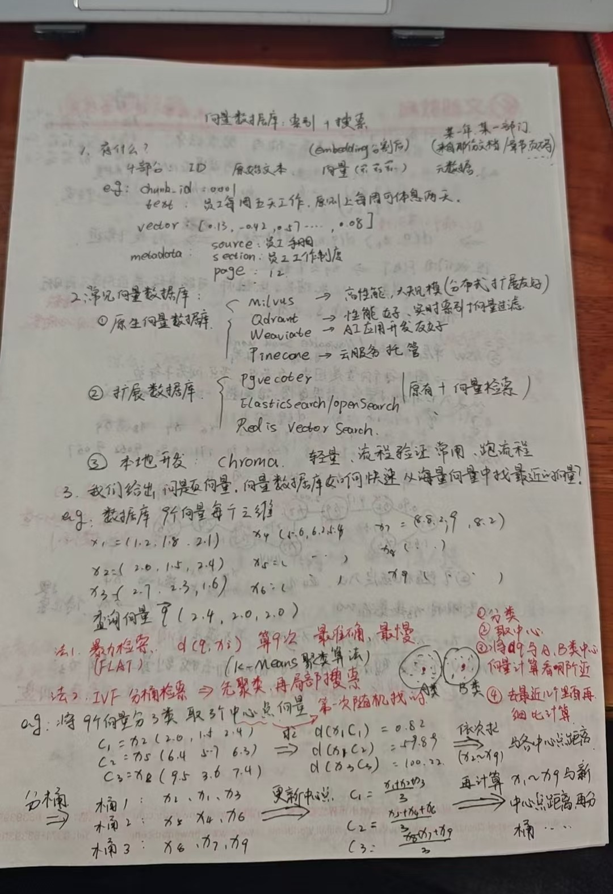
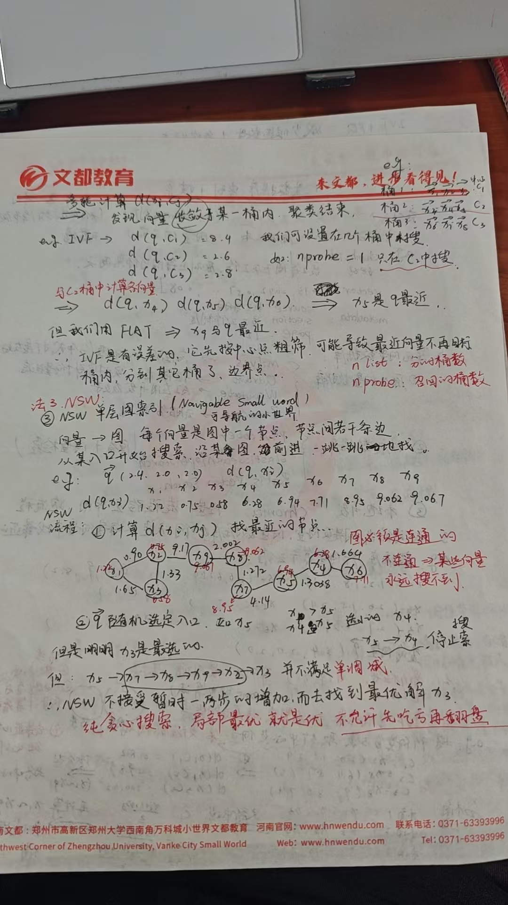
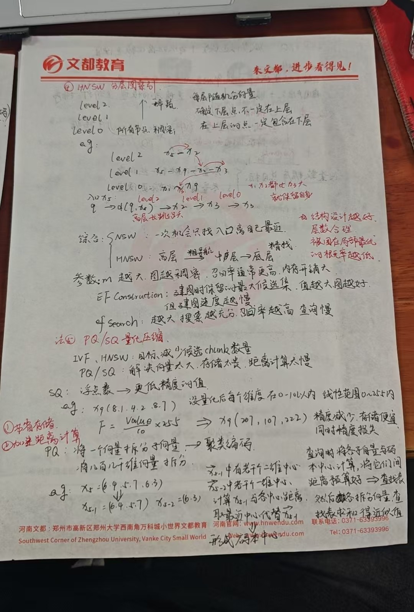
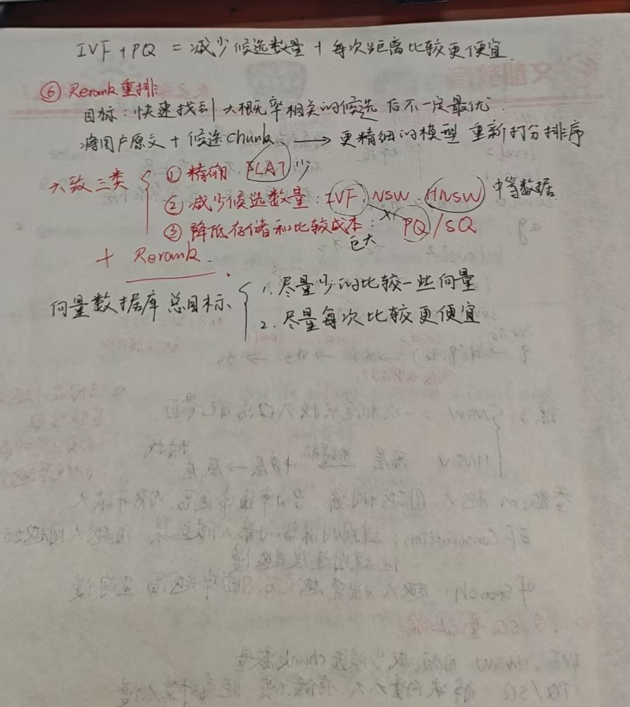

# 向量数据库全解析-索引算法&底层原理

***

## 一、向量数据库是什么？

向量数据库（Vector Database）是专门用于存储、索引和检索高维向量的数据库系统。在大模型（LLM）和 AI 应用中，向量数据库承担着语义检索的核心角色——将文本通过 Embedding 模型转化为向量，再通过向量相似度计算实现"语义级别"的检索。

### 1.1 向量数据库存储了什么？

每条向量数据通常包含以下四个部分：

| 字段       | 说明             | 示例                                        |
| -------- | -------------- | ----------------------------------------- |
| **ID**   | 唯一标识符          | `chunk_id: 00001`                         |
| **原始文本** | Embedding 前的文本 | 员工每周五天工作，原则上每周可休息两天。                      |
| **向量**   | n 维浮点数         | `[0.13, -0.42, ..., 2.57, ..., 1.08]`     |
| **元数据**  | 辅助过滤/权限控制      | `{source: 员工手册, section: 工作制度, page: 12}` |

> **元数据（Metadata）** 的作用不可小觑——它可以用于权限过滤（如"只搜索 2024 年的文档"）、标签分类（如"只搜索人力资源部门"）等，是生产环境中向量检索的重要辅助手段。

### 1.2 常见的向量数据库产品

#### ① 原生向量数据库

| 数据库          | 特点                     |
| ------------ | ---------------------- |
| **Milvus**   | 高性能，支持大规模分布式扩展，适合企业级部署 |
| **Qdrant**   | 性能优秀，支持实时索引和向量过滤       |
| **Weaviate** | AI 应用开发友好，内置多模态支持      |
| **Pinecone** | 全托管云服务，零运维开箱即用         |

#### ② 扩展型数据库

- **pgvector**：基于 PostgreSQL 的向量扩展，适合已有 PG 技术栈的团队
- **Elasticsearch / OpenSearch**：在原有全文检索能力基础上增加向量检索
- **Redis Vector Search**：基于 Redis 的向量检索扩展，适合低延迟场景

#### ③ 本地开发工具

- **Chroma**：轻量级向量数据库，常用于原型验证和流程调试

***

## 二、核心问题：如何快速找到最相似的向量？

向量数据库的核心挑战可以用一句话概括：

> **核心问题**：给定一个查询向量 q，如何从海量向量中快速找到与 q 最相似（距离最近）的 k 个向量？

举个例子：假设数据库中有 9 个三维向量，查询向量 q = (2.4, 2.0, 2.0)，我们需要找到与 q 最接近的向量。最直观的方法是把 q 和所有向量都计算一遍距离，但当数据量从 9 个增长到上亿个时，这种方法就完全不可行了。

为此，向量数据库的两大总目标是：

- **目标 1**：尽量减少需要比较的向量数量
- **目标 2**：尽量降低每次距离计算的成本

围绕这两大目标，业界发展出了多种索引算法，下面我们逐一拆解。

***

## 三、方法一：FLAT 暴力检索

FLAT（暴力检索）是最简单也是最准确的方法：计算查询向量 q 与数据库中每一个向量的距离 d(q, x\_i)，然后排序取 Top-K。

> **优缺点**
>
> - **优点**：结果 100% 准确，召回率最高。
> - **缺点**：时间复杂度为 O(n)，数据量大时性能急剧下降。
> - **适用场景**：仅适用于小规模数据集（通常小于 10 万条）。

***

## 四、方法二：IVF 分桶检索

### 4.1 核心思想

IVF（Inverted File Index，倒排索引）的核心思想是：**先聚类，再局部搜索**。它使用 K-Means 聚类算法将所有向量分成 n\_list 个桶（Bucket），每个桶有一个中心向量。查询时，先计算 q 与各桶中心的距离，只在距离最近的 n\_probe 个桶内进行精确搜索。

### 4.2 工作流程

**第一步：聚类分桶**

使用 K-Means 将所有向量分成若干类，每类计算一个中心向量。例如将 9 个向量分成 3 类，得到中心点 C1、C2、C3。聚类过程会多轮迭代，每轮重新计算中心点并重新分配向量，直到收敛。

**第二步：粗筛**

查询时，计算 q 与所有桶中心的距离 d(q, C\_i)，选取距离最近的 n\_probe 个桶。

**第三步：精搜**

在选中的桶内，计算 q 与桶内每个向量的距离，返回最近的 Top-K 结果。

### 4.3 关键参数

| 参数           | 说明                                                   |
| ------------ | ---------------------------------------------------- |
| **n\_list**  | 分桶数量。桶越多，每个桶越小，精搜范围越小，但粗筛成本越高                        |
| **n\_probe** | 召回的桶数。值越大，召回率越高，但查询越慢。当 n\_probe = n\_list 时退化为 FLAT |

> ⚠️ **注意：IVF 的误差问题**
>
> IVF 是有误差的！因为它先按中心点粗筛，可能导致真正最近的向量被分到了其他桶中（**边界点问题**）。通过增大 n\_probe 可以缓解这个问题，但会牺牲性能。

***

## 五、方法三：NSW 可导航小世界图

### 5.1 核心思想

NSW（Navigable Small World，可导航小世界）将向量转化为图结构：每个向量是图中的一个节点，节点间通过边连接，边的权重代表两个向量间的距离。搜索时从某个入口节点出发，沿着图一步一步地"贴近"目标。

### 5.2 搜索过程

假设查询向量 q = (2.4, 2.0, 2.9)，随机选定入口节点 x5，搜索路径可能是：

```
x5 → x7 → x6 → x9 → x2 → x3

其中 d(q, x3) = 0.58 是最近的
```

### 5.3 NSW 的局限性

> ⚠️ **关键缺陷：纯贪心搜索容易陷入局部最优！**
>
> NSW 不接受"暂时吃亏"的路径——即使某一步距离增大了，也不会继续前进，而是直接停止。这导致它可能错过真正最优的结果。此外，图必须保持连通性，否则某些向量将永远无法被搜索到。

***

## 六、方法四：HNSW 分层小世界图

### 6.1 核心思想

HNSW（Hierarchical Navigable Small World，分层可导航小世界）是 NSW 的进化版本，引入了"分层"概念，解决了 NSW 的局部最优问题。

**类比理解：** 就像地图一样，高层级别的地图只有少量关键节点（省会、首都），用于长距离导航；低层级别的地图包含所有节点，用于精确定位。

### 6.2 分层结构

- **Level 0**：所有向量都在这一层，图最稠密，用于精确搜索
- **Level 1**：随机选取部分向量，图较稀疏，用于中等距离导航
- **Level 2+**：更少的向量，图最稀疏，用于长距离跳转

> **重要规则**：在上层的向量一定包含在下层，但下层的向量不一定在上层。

### 6.3 搜索过程

从最高层入口开始，在每一层执行贪心搜索找到最近节点，然后"下降"到下一层继续搜索，直到 Level 0 得到最终结果。

```
高层：粗导航 → 快速跳转到目标区域
中层：中等导航 → 进一步缩小范围
底层：精确搜索 → 找到最终答案
```

### 6.4 关键参数

| 参数                  | 说明                                   |
| ------------------- | ------------------------------------ |
| **M**               | 每个节点的最大连接数。M 越大，图越稠密，召回率通常更高，但内存开销越大 |
| **EF Construction** | 建图时保留的最大候选集大小。值越大，图质量越好，但建图速度越慢      |
| **EF Search**       | 搜索时的候选集大小。值越大，搜索越充分，召回率越高，但查询越慢      |

> 💡 **实践建议**：结构设计越好、层数设置越合理，被困在局部最优的概率就越低。建议根据数据规模和延迟要求调优这三个参数，找到性能与准确性的平衡点。

***

## 七、方法五：PQ / SQ 量化压缩

### 7.1 为什么需要量化？

IVF 和 HNSW 的目标是减少候选向量的数量，而 PQ/SQ 的目标则不同——它们解决的是"向量太大、存储太贵、距离计算太慢"的问题。对于数百乃至数千维的向量，量化压缩能显著降低存储和计算成本。

### 7.2 SQ（标量量化）

SQ 的思想很简单：将高精度浮点数映射为低精度的整数值。例如，将每个维度的值从 float32 压缩到 0\~100 的整数范围。

```
原始向量: xq = [8.1, 4.2, 8.7]
量化公式: F = Value / 10 * 25
量化后:   xq = [20, 10, 22]
```

- **优点**：实现简单，压缩和解压速度快
- **缺点**：压缩比有限，精度损失相对较大

### 7.3 PQ（乘积量化）

PQ 的思想更加精妙：将一个高维向量拆分为若干个低维子向量，对每个子向量单独进行聚类编码，用聚类中心的编号代替原始向量。

**工作流程：**

1. 将原始向量拆分为多个子向量（如将 768 维拆为 96 个 8 维子向量）
2. 对每个子向量空间进行 K-Means 聚类，形成码本（Codebook）
3. 用最近聚类中心的编号代替原始子向量
4. 查询时将各子向量与码本中心计算距离，通过查表求和得到近似距离

PQ 的优势在于压缩比极高（可达数十倍，如 768 维向量拆为 96 个 8 维子向量后，每个子向量用 1 字节存储，可实现约 32 倍压缩），特别适合大规模数据集。与 IVF 结合使用时（**IVF + PQ**），可以同时实现"减少候选数量 + 每次比较更便宜"的双重优化。

***

## 八、补充：Rerank 重排机制

无论采用哪种 ANN 算法，其本质都是"近似搜索"，得到的结果只是"大概率相关"的候选，不一定是最优的。**Rerank（重排）机制**就是用来解决这个问题的。

**工作原理：** 将用户原文查询 + 候选 chunks 输入到一个更精细的模型（如 Cross-Encoder），重新打分并排序，从而显著提升最终结果的准确性。

实际应用中，典型的 RAG 检索流程为：

```
向量检索（快速召回数十/数百候选）→ Rerank（精细排序取 Top-10）→ 输入 LLM 生成回答
```

***

## 九、总结与对比

### 9.1 算法分类总览

| 类别           | 算法      | 核心策略        | 适用场景          |
| ------------ | ------- | ----------- | ------------- |
| **精确检索**     | FLAT    | 遍历所有向量      | 小规模数据（< 10 万） |
| **减少候选数量**   | IVF     | 聚类分桶 + 局部搜索 | 中等规模数据        |
|              | NSW     | 图结构 + 贪心搜索  | 中等规模数据        |
|              | HNSW    | 分层图 + 多层导航  | 中大规模数据        |
| **降低比较成本**   | PQ / SQ | 向量压缩 + 查表计算 | 大规模数据（巨量）     |
| **后处理**      | Rerank  | 精细模型重新打分    | 所有场景（提升精度）    |

### 9.2 实际应用建议

- **小数据集（< 10 万）**：直接用 FLAT，简单高效，结果最准确
- **中等数据集（10 万 \~ 1000 万）**：优先选择 HNSW，性能与准确性平衡最佳
- **大规模数据（> 1000 万）**：推荐 IVF + PQ 组合，同时减少候选数量和比较成本
- **生产环境**：建议在向量检索后加一层 Rerank，显著提升最终检索质量

***

> **向量数据库的两大总目标**
>
> 🎯 目标 1：尽量少的比较一些向量
>
> 🎯 目标 2：尽量每次比较更便宜

### 有些手写体不好打字表示，下面是我总结的手写笔记，可能更易懂一些。大家可以参考。

{style="zoom:50%;"}

{style="zoom:50%;"}

{style="zoom:50%;"}

{style="zoom:50%;"}

