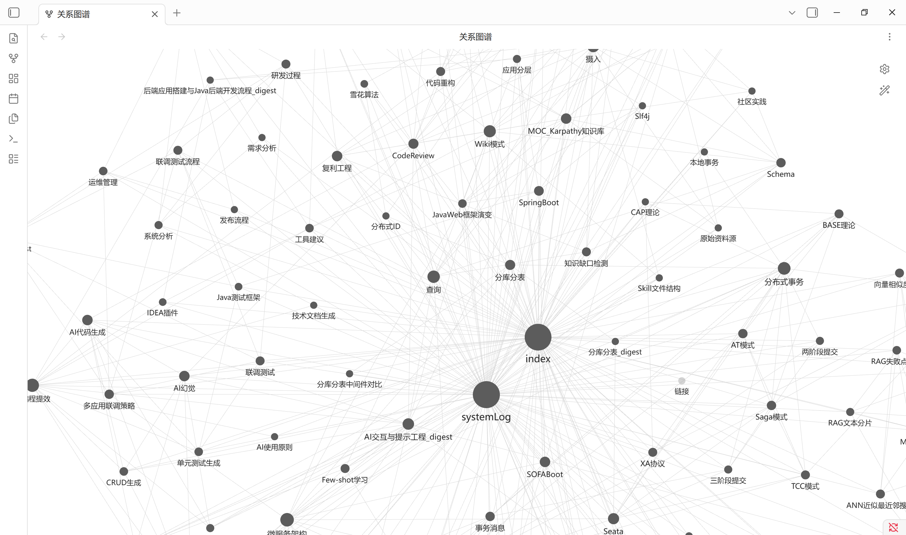
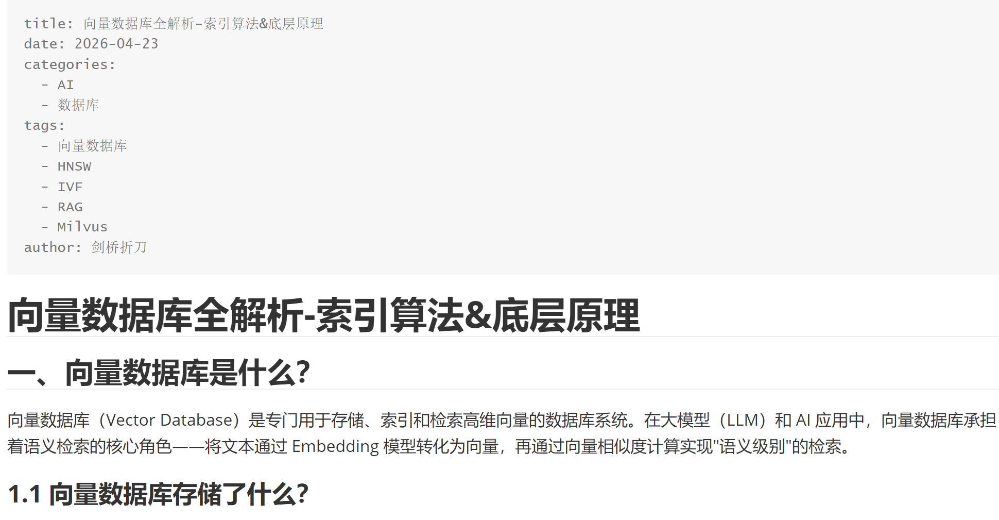
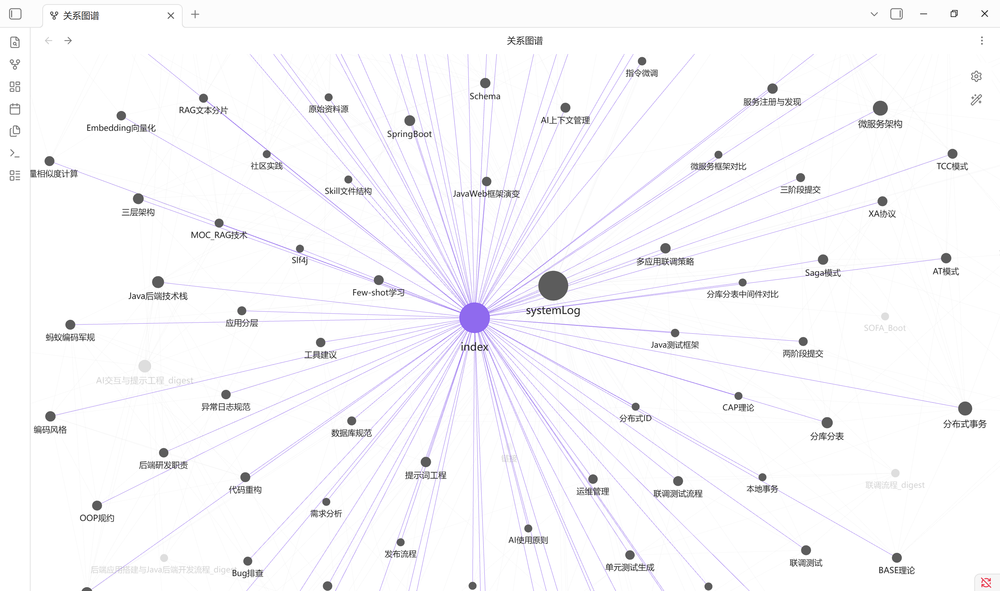
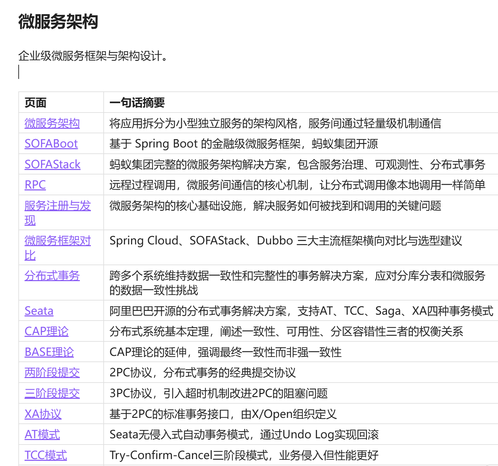

# 构建极速文件检索系统：从原理到实战

## 一、前言：为什么需要自建检索系统？

事情是这样的。

我之前根据Karpathy推文，基于LLM+复利+Wiki构建个人知识库。经过两个月的文章摄取目前个人知识库已经有100+节点。但是每一次我在使用Trae进行知识查询，文档管理，节点维护时候。我发现他总能快速准确在我的100+节点中快速查询我提问的知识点或者代码块。这让我感到非常好奇，它是怎么做到的呢？

我们可以想象一下：当你的维护着一个包含上千篇技术文档的 Wiki 知识库，当需要查找某个知识点时，他是否可以一如既往快速、准确？

我是否可以在我的xxx项目中融入这个模块，实现我的项目快速检索文件。

今天，我们就来拆解Agent常用的检索原理。提前说明一下，它不需要复杂的向量数据库，不需要预训练模型，仅凭几个开源工具的组合，就能实现比传统 RAG 更快的检索速度。

> **特别注意**
> 本文介绍的方案最适合纯文本内容（如 Markdown、代码文件）。如果你需要处理 PDF、Word 等富文本格式，建议先转换为纯文本再使用本方案。

***

## 二、核心原理：三层递进式检索策略

我们的检索系统采用"分层过滤"的思想，就像漏斗一样，每一层都过滤掉不相关的内容，最终精准定位到目标。

### 2.1 整体架构

```
┌─────────────────────────────────────────────────────────┐
│                    用户查询输入                          │
│              "Kafka 如何保证消息顺序性？"                  │
└──────────────────────┬──────────────────────────────────┘
                       ↓
┌─────────────────────────────────────────────────────────┐
│  第一层：关键词提取                                       │
│  提取：Kafka、顺序、顺序性、有序                           │
└──────────────────────┬──────────────────────────────────┘
                       ↓
┌─────────────────────────────────────────────────────────┐
│  第二层：文件名快速匹配（Glob工具）                        │
│  查找：*Kafka*.md、*消息*.md                              │
└──────────────────────┬──────────────────────────────────┘
                       ↓ 未找到？进入第三层
┌─────────────────────────────────────────────────────────┐
│  第三层：全文内容搜索（Grep工具）                          │
│  搜索：rg "Kafka|顺序|顺序性|有序" ./wiki                  │
└──────────────────────┬──────────────────────────────────┘
                       ↓
┌─────────────────────────────────────────────────────────┐
│  第四层：精准定位读取（Read工具）                          │
│  读取：RocketMQ.md 第350-370行                           │
└─────────────────────────────────────────────────────────┘
```

### 2.2 为什么这种架构这么快？

| 优化点            | 原理说明                   |          效果         |
| :------------- | :--------------------- | :-----------------: |
| **文件名即索引**     | 规范命名的文件本身就是最好的索引       |      减少90%的无效搜索     |
| **ripgrep 引擎** | 基于 Rust 编写，支持并行搜索和内存映射 | 比传统 grep 快 10-100 倍 |
| **分层过滤**       | 每一层都缩小搜索范围             |        避免全量扫描       |
| **精准读取**       | 只读取需要的行，而非整个文件         |       减少 IO 开销      |

***

## 三、实战：从零搭建你的检索系统

### 3.1 环境准备

首先，我们需要安装核心工具 **ripgrep**（简称 rg）。这是一个用 Rust 编写的超快文本搜索工具。

#### macOS 安装

```bash
brew install ripgrep
```

#### Ubuntu/Debian 安装

```bash
sudo apt-get install ripgrep
```

#### Windows 安装

```powershell
# 使用 Chocolatey
choco install ripgrep

# 或使用 Scoop
scoop install ripgrep
```

安装完成后，验证一下：

```bash
rg --version
# 输出示例：ripgrep 14.1.0
```

> **常见错误**
> 如果你在 Windows 上遇到 "rg 不是内部或外部命令"，请检查环境变量是否配置正确，或者尝试重启终端。

### 3.2 第一层：文件名匹配（Glob）

Glob 是一种文件路径匹配模式，类似于你在命令行中使用的 `*.md`。

假设你的 Wiki 目录结构如下：

```
wiki/
├── RocketMQ.md
├── Kafka.md
├── 消息中间件.md
├── Redis.md
└── 缓存技术.md
```

使用 Glob 快速查找相关文件：

```bash
# 查找所有 Markdown 文件
ls wiki/*.md

# 查找包含 "消息" 的文件
glob "wiki/*消息*.md"
```

在 Python 中实现：

```python
from pathlib import Path

def glob_search(pattern, base_path="./wiki"):
    """Glob 文件匹配"""
    return list(Path(base_path).glob(pattern))

# 使用示例
files = glob_search("*消息*.md")
print(files)
# 输出：[PosixPath('wiki/消息中间件.md')]
```

### 3.3 第二层：全文内容搜索（Grep）

当文件名匹配不到时，我们就需要搜索文件内容了。这是 ripgrep 的强项。

#### 基础用法

```bash
# 在当前目录递归搜索 "Kafka"
rg "Kafka" ./wiki

# 搜索多个关键词（或关系）
rg "Kafka|顺序|顺序性|有序" ./wiki

# 只显示匹配的文件名（不显示具体内容）
rg -l "Kafka" ./wiki

# 显示行号和上下文
rg -n -C 3 "Kafka" ./wiki
```

#### 搜索结果示例

```bash
$ rg -n "顺序消息" ./wiki

wiki/RocketMQ.md:354:| 顺序消息 | ✅ 局部顺序 | ✅ 分区顺序 |
wiki/RocketMQ.md:412:### 顺序消息的实现原理
wiki/Kafka.md:203:| 顺序保证 | 分区级别 | 全局顺序 |
```

看到没？我们一下子就知道哪些文件包含相关内容，以及具体在哪一行。

#### Python 封装

```python
import subprocess
from pathlib import Path

def grep_search(pattern, path, output_mode="content"):
    """使用 ripgrep 搜索
    
    Args:
        pattern: 搜索模式，支持正则表达式
        path: 搜索路径
        output_mode: "content" 返回内容，"files" 只返回文件名
    """
    cmd = ["rg", "-n", pattern, path]
    if output_mode == "files":
        cmd.insert(1, "-l")
    
    result = subprocess.run(cmd, capture_output=True, text=True)
    
    # 解析结果
    matches = []
    for line in result.stdout.strip().split('\n'):
        if ':' in line:
            parts = line.split(':', 2)
            if len(parts) >= 3:
                matches.append({
                    'file': Path(parts[0]).name,
                    'line': int(parts[1]),
                    'content': parts[2].strip()
                })
    
    return matches

# 使用示例
results = grep_search("Kafka|顺序|顺序性|有序", "./wiki")
for r in results[:5]:  # 只看前5条
    print(f"{r['file']}:{r['line']} - {r['content'][:50]}...")
```

### 3.4 第三层：精准读取（Read）

找到相关文件和行号后，我们不需要读取整个文件，只需要读取目标区域即可。

```python
def read_file(filename, offset=1, limit=50, base_path="./wiki"):
    """精准读取文件特定区域
    
    Args:
        filename: 文件名
        offset: 起始行号（从1开始）
        limit: 读取行数
    """
    file_path = Path(base_path) / filename
    
    if not file_path.exists():
        return None
    
    lines = file_path.read_text(encoding='utf-8').split('\n')
    start = max(0, offset - 1)
    end = min(len(lines), offset - 1 + limit)
    
    return '\n'.join(lines[start:end])

# 使用示例：读取 RocketMQ.md 第350-370行
content = read_file("RocketMQ.md", offset=350, limit=20)
print(content)
```

***

## 四、完整封装：WikiSearch 类

为了方便使用，我们把上述功能封装成一个类：

```python
import os
import re
import subprocess
from pathlib import Path

class WikiSearch:
    """Wiki 知识库检索系统"""
    
    def __init__(self, wiki_path):
        self.wiki_path = Path(wiki_path)
        self.file_index = {}  # 文件名索引
        self._build_index()
    
    def _build_index(self):
        """构建文件索引"""
        for md_file in self.wiki_path.glob("*.md"):
            # 索引文件名（不含扩展名）
            self.file_index[md_file.stem.lower()] = md_file
    
    def glob(self, pattern):
        """Glob 文件匹配"""
        return list(self.wiki_path.glob(pattern))
    
    def grep(self, pattern, keywords=None):
        """Grep 内容搜索（使用 ripgrep）"""
        cmd = ["rg", "-n", "-i", pattern, str(self.wiki_path)]
        result = subprocess.run(cmd, capture_output=True, text=True)
        
        matches = []
        for line in result.stdout.strip().split('\n'):
            if ':' in line:
                parts = line.split(':', 2)
                if len(parts) >= 3:
                    matches.append({
                        'file': Path(parts[0]).name,
                        'line': int(parts[1]),
                        'content': parts[2].strip()
                    })
        return matches
    
    def read(self, filename, offset=1, limit=50):
        """Read 文件读取"""
        file_path = self.wiki_path / filename
        if not file_path.exists():
            return None
        
        lines = file_path.read_text(encoding='utf-8').split('\n')
        start = max(0, offset - 1)
        end = min(len(lines), offset - 1 + limit)
        
        return '\n'.join(lines[start:end])
    
    def search(self, query, top_k=5):
        """智能搜索：结合文件名匹配和全文搜索"""
        # 第一步：尝试文件名匹配
        keywords = query.lower().split()
        for keyword in keywords:
            for name, path in self.file_index.items():
                if keyword in name:
                    return [{
                        'type': 'filename_match',
                        'file': path.name,
                        'reason': f'文件名包含关键词 "{keyword}"'
                    }]
        
        # 第二步：全文搜索
        pattern = "|".join(keywords)
        results = self.grep(pattern)
        
        return results[:top_k]

# ============ 使用示例 ============

if __name__ == "__main__":
    # 初始化搜索器
    search = WikiSearch("./wiki")
    
    # 场景1：搜索关键词
    print("=== 搜索 'Kafka 顺序性' ===")
    results = search.search("Kafka 顺序性")
    for r in results:
        print(f"  {r['file']}:{r['line']} - {r['content'][:60]}...")
    
    # 场景2：精准读取
    print("\n=== 读取 RocketMQ.md 相关内容 ===")
    content = search.read("RocketMQ.md", offset=350, limit=20)
    print(content)
```

***

## 五、进阶：对比传统 RAG

你可能好奇，这种方案和传统 RAG 相比有什么优劣？

| 维度       | 传统 RAG（向量搜索）    | 本方案（关键词+全文索引） |
| :------- | :-------------- | :------------ |
| **原理**   | 向量化 → 语义搜索      | 关键词 + 全文索引    |
| **速度**   | 慢（需要 embedding） | 极快（毫秒级）       |
| **准确性**  | 依赖向量质量，有模糊性     | 精确匹配，结果可解释    |
| **实时性**  | 需要预构建索引         | 随时搜索最新内容      |
| **适用场景** | 语义理解、相似度匹配      | 精确查找、技术文档检索   |

### 5.1 什么时候用 RAG？

- 需要理解用户意图的语义搜索
- 处理非结构化文本（如聊天记录、邮件）
- 需要处理同义词、近义词匹配

### 5.2 什么时候用本方案？

- 技术文档、知识库检索
- 需要精确匹配的场景
- 对响应速度要求极高
- 不想维护复杂的向量数据库

***

## 六、性能优化建议

如果你想让检索系统更快，可以考虑以下优化：

### 6.1 文件命名规范

```
# ❌ 不好的命名
2024-01-01-notes.md
doc-v2-final.md

# ✅ 好的命名
Kafka消息队列.md
Redis缓存策略.md
分布式事务解决方案.md
```

### 6.2 添加 YAML Frontmatter

示例如下：


在每个文档头部添加元数据，方便分类检索：

```markdown
---
title: Kafka 消息顺序性详解
tags: [消息队列, 顺序性, Kafka]
category: 分布式系统
date: 2024-01-15
---

# 正文内容...
```

### 6.3 维护索引文件

定期生成一个 `index.md`，汇总所有文档的核心内容：





```Markdown
# Wiki 索引

## 消息队列
- [Kafka消息队列](./Kafka.md) - 分布式消息流平台
- [RocketMQ](./RocketMQ.md) - 阿里开源消息中间件

## 缓存技术
- [Redis缓存策略](./Redis.md) - 内存数据结构存储
```

***

## 七、总结

今天我们构建了一个极速文件检索系统，核心思路是：

1. **Glob** = 文件名快速匹配
2. **Grep** = ripgrep 全文搜索
3. **Read** = 精准定位读取

这套方案的优势在于：

- ✅ 纯文本 + 全文索引，无需复杂依赖
- ✅ 无需预构建向量索引，实时搜索
- ✅ 毫秒级响应速度
- ✅ 结果可解释性强

如果你的 Wiki 文件数量在 5000个以内，这套方案还是够用的。如果超过 10000 个文件，可以考虑引入 Elasticsearch 或 Meilisearch 等专业搜索引擎。

***

**参考资源**

| 工具      | 用途         | 链接                                      |
| :------ | :--------- | :-------------------------------------- |
| ripgrep | 超快文本搜索     | <https://github.com/BurntSushi/ripgrep> |
| fd      | 快速文件查找     | <https://github.com/sharkdp/fd>         |
| fzf     | 模糊查找       | <https://github.com/junegunn/fzf>       |
| Whoosh  | Python全文索引 | <https://whoosh.readthedocs.io/>        |

***

*本文作者：剑桥折刀*\
*创建时间：2026-06-01*\
*如果你觉得这篇文章有帮助，欢迎点赞收藏！*
